# 🧠 Linear Integration Rules - Synapse Project

## Sistema Ultra-Inteligente de Documentação Automática com IA

> **"O Linear não é apenas uma ferramenta - é a memória coletiva inteligente do Synapse."**

---

## 🎯 Princípio Central: Cognitive Documentation System

```mermaid
graph TD
    A[💭 Ideia/Requisito] --> B[🤖 IA Analisa Contexto]
    B --> C{Complexidade?}
    C -->|Alta| D[📝 Issue Completa + Diagrama]
    C -->|Média| E[📝 Issue Padrão]
    C -->|Baixa| F[📝 Quick Update]
    D --> G[⚙️ Dev com Auto-Update]
    E --> G
    F --> G
    G --> H[🧪 Testes + Screenshots]
    H --> I{Quality Score}
    I -->|< 70| J[🔴 Needs Improvement]
    I -->|70-89| K[🟡 Good]
    I -->|≥ 90| L[🟢 Excellent]
    J --> M[📊 Sugestões IA]
    K --> N[✅ Done]
    L --> N
    
    style A fill:#1a1a2e,color:#fff
    style B fill:#16213e,color:#fff
    style I fill:#0f3460,color:#fff
    style L fill:#00d4aa,color:#000
```



---

## 🎨 Sistema de Tags Inteligente + Priorização Automática

| Tag | Cor | Prioridade | Auto-Apply Quando | Exemplo |
|-----|-----|------------|-------------------|---------|
| `🚨 Critical` | Vermelho Escuro | P0 | System down, data loss | Production bug |
| `🚀 Feature` | Roxo Neon | P1-P2 | Nova funcionalidade | Oracle V2.1 |
| `🐛 Bug` | Vermelho | P2 | Erro funcional | Fix JSON parsing |
| `⚡ Performance` | Amarelo | P2-P3 | Latência > 3s | Cache optimization |
| `🎨 UI/UX` | Rosa | P3 | Interface/Design | Tradução PT-BR |
| `🔧 Refactor` | Azul | P3-P4 | Code smell > 5 | Clean architecture |
| `📚 Docs` | Verde | P4 | Falta documentação | API docs |
| `🧪 Tests` | Ciano | P2 | Coverage < 80% | E2E tests |
| `🤖 AI/ML` | Roxo Escuro | P1 | LLM integration | Sentiment analysis |
| `🔒 Security` | Laranja | P1 | Vulnerabilidade | Auth bypass |

---

## 📊 Quality Scoring System (Auto-Calculado)

### Algoritmo de Qualidade

```python
def calculate_issue_quality_score(issue: LinearIssue) -> int:
    """
    Calcula score de qualidade de 0-100 para uma issue.
    Issues com score < 70 recebem sugestões automáticas.
    """
    score = 0
    
    # Estrutura Básica (30 pontos)
    if issue.title and len(issue.title) > 10:
        score += 10
    if issue.description and len(issue.description) > 100:
        score += 10
    if issue.has_labels:
        score += 10
    
    # Documentação Técnica (40 pontos)
    if has_mermaid_diagram(issue.description):
        score += 15
    if has_code_snippets(issue.description):
        score += 10
    if has_stack_table(issue.description):
        score += 10
    if has_file_links(issue.description):
        score += 5
    
    # Validação e Testes (30 pontos)
    if has_test_section(issue.description):
        score += 10
    if has_screenshots(issue.description):
        score += 10
    if has_metrics_table(issue.description):
        score += 10
    
    return min(score, 100)  # Cap at 100

# Classificação
# 0-69:  🔴 Needs Improvement (sugestões automáticas)
# 70-89: 🟡 Good (aprovada)
# 90-100: 🟢 Excellent (destaque no dashboard)
```

### Dashboard Virtual de Qualidade

````markdown
## 📊 Synapse Issues Quality Dashboard

**Última Atualização:** 2026-01-20 13:15

### Visão Geral
| Métrica | Valor | Target | Status |
|---------|-------|--------|--------|
| **Média de Quality Score** | 87 | > 80 | 🟢 |
| **Issues Excellent (≥90)** | 12 | > 10 | 🟢 |
| **Issues Needs Work (<70)** | 2 | 0 | 🟡 |
| **Tempo Médio até Done** | 4.2d | < 7d | 🟢 |
| **Coverage de Testes** | 89% | > 80% | 🟢 |

### Top 5 Issues (Ordenado por Score)

| Issue | Título | Score | Status |
|-------|--------|-------|--------|
| SYN-13 | 🔮 The Oracle | 98 🟢 | ✅ Done |
| SYN-17 | 📉 Trend Check | 95 🟢 | ✅ Done |
| SYN-18 | 💬 Sentiment Pulse | 93 🟢 | ✅ Done |
| SYN-14 | ✅ Automation Suite | 72 🟡 | ⏳ In Progress |
| SYN-20 | 📦 Batch Manager | 65 🔴 | 🔲 To Do |

### Action Items (Auto-Gerados)
- 🔴 **SYN-20:** Adicionar diagrama de arquitetura (+15 pts)
- 🔴 **SYN-20:** Documentar testes (+10 pts)
````

---

## ⚡ Templates Dinâmicos com Variáveis

### Template Generator

````python
def generate_smart_template(issue_type: str, complexity: int) -> str:
    """
    Gera template personalizado baseado no tipo e complexidade.
    """
    templates = {
        "feature_complex": FEATURE_PREMIUM_TEMPLATE,
        "feature_simple": FEATURE_QUICK_TEMPLATE,
        "bug": BUG_FIX_TEMPLATE,
        "performance": PERFORMANCE_TEMPLATE
    }
    
    if issue_type == "feature":
        template_key = "feature_complex" if complexity > 5 else "feature_simple"
    else:
        template_key = issue_type
    
    return templates[template_key]

# Uso
template = generate_smart_template("feature", complexity=8)
# → Retorna FEATURE_PREMIUM_TEMPLATE com todos os campos
````

### Template Premium (Complexidade > 5)

````markdown
## 🚀 {{FEATURE_NAME}}

### Status: 🔲 Planning → ⏳ In Progress → 🧪 In Review → ✅ Done
### Quality Score: {{AUTO_CALCULATED}} | Priority: {{AUTO_ASSIGNED}}

> **TL;DR:** {{ONE_LINE_SUMMARY}}

---

### 🎯 Contexto (Auto-Expandido)

**Problema Identificado:**
{{PROBLEM_DESCRIPTION}}

**Impacto Esperado:**
- 📈 {{METRIC_1}}: {{VALUE_1}}
- 🎨 {{METRIC_2}}: {{VALUE_2}}
- 🤖 {{METRIC_3}}: {{VALUE_3}}

**Stakeholders:**
- 👤 Product: {{PRODUCT_OWNER}}
- 💻 Engineering: {{TECH_LEAD}}
- 🎨 Design: {{DESIGNER}}

---

### 🏛️ Arquitetura (Auto-Detectada)

**Complexity Score:** {{COMPLEXITY_1_10}}

```mermaid
{{AUTO_GENERATED_DIAGRAM}}
```

**Decisões Arquiteturais:**
| # | Decisão | Alternativa Considerada | Justificativa | Score |
|---|---------|-------------------------|---------------|-------|
| 1 | {{DECISION_1}} | {{ALT_1}} | {{REASON_1}} | {{SCORE_1}}/10 |
| 2 | {{DECISION_2}} | {{ALT_2}} | {{REASON_2}} | {{SCORE_2}}/10 |

---

### 🛠️ Stack + Dependências (Auto-Listadas)

**Core Stack:**
| Layer | Technology | Version | Justificativa |
|-------|------------|---------|---------------|
| Frontend | {{FE_TECH}} | {{FE_VERSION}} | {{FE_REASON}} |
| Backend | {{BE_TECH}} | {{BE_VERSION}} | {{BE_REASON}} |
| Database | {{DB_TECH}} | {{DB_VERSION}} | {{DB_REASON}} |
| AI/ML | {{AI_TECH}} | {{AI_VERSION}} | {{AI_REASON}} |

**Dependências Externas:**
- 📦 {{PACKAGE_1}} `{{VERSION_1}}` - {{USAGE_1}}
- 📦 {{PACKAGE_2}} `{{VERSION_2}}` - {{USAGE_2}}

---

### 📁 Code Changes (Auto-Tracked)

**Files Modified:** {{FILE_COUNT}} | **Lines Changed:** {{LOC_TOTAL}} (+{{LOC_ADD}} -{{LOC_DEL}})

| File | Type | LOC | Complexity | Link |
|------|------|-----|-----------|------|
| {{FILE_1}} | {{TYPE_1}} | {{LOC_1}} | {{COMPLEXITY_1}} | [View]({{LINK_1}}) |
| {{FILE_2}} | {{TYPE_2}} | {{LOC_2}} | {{COMPLEXITY_2}} | [View]({{LINK_2}}) |

**Commits Principais:**
- `{{COMMIT_1_HASH}}` - {{COMMIT_1_MSG}} ({{COMMIT_1_DATE}})
- `{{COMMIT_2_HASH}}` - {{COMMIT_2_MSG}} ({{COMMIT_2_DATE}})

---

### 🔌 API Changes (Auto-Documented)

**Endpoints Criados:** {{ENDPOINT_COUNT}}

| Method | Endpoint | Request Schema | Response Schema | Status |
|--------|----------|----------------|-----------------|--------|
| {{METHOD_1}} | `{{ROUTE_1}}` | [Schema]({{REQ_1}}) | [Schema]({{RES_1}}) | {{STATUS_1}} |

**OpenAPI Spec:**
```yaml
{{AUTO_GENERATED_OPENAPI}}
```

---

### 🧪 Testing Strategy (Auto-Generated)

**Coverage Target:** {{COVERAGE_TARGET}}% | **Actual:** {{COVERAGE_ACTUAL}}% | **Status:** {{COVERAGE_STATUS}}

#### Test Pyramid
```
       /\
      /E2E\      {{E2E_COUNT}} tests ({{E2E_TIME}}s)
     /------\
    /Integr.\   {{INT_COUNT}} tests ({{INT_TIME}}s)
   /----------\
  /   Unit    \ {{UNIT_COUNT}} tests ({{UNIT_TIME}}s)
 /--------------\
```

#### Test Cases
| Type | Test Name | Status | Duration | Coverage Impact |
|------|-----------|--------|----------|-----------------|
| Unit | {{TEST_1}} | {{STATUS_1}} | {{TIME_1}}ms | +{{COV_1}}% |
| Integration | {{TEST_2}} | {{STATUS_2}} | {{TIME_2}}ms | +{{COV_2}}% |
| E2E | {{TEST_3}} | {{STATUS_3}} | {{TIME_3}}s | +{{COV_3}}% |

#### Manual Validation
- [x] **Happy Path:** {{HAPPY_DESC}}
- [x] **Error Cases:** {{ERROR_DESC}}
- [x] **Edge Cases:** {{EDGE_DESC}}

---

### 📊 Performance Benchmarks (Auto-Collected)

**Target:** {{TARGET_LATENCY}}ms | **Actual:** {{ACTUAL_LATENCY}}ms | **Delta:** {{DELTA}}%

| Metric | Before | After | Change | Target | Status |
|--------|--------|-------|--------|--------|--------|
| Latency (p50) | {{P50_BEFORE}} | {{P50_AFTER}} | {{P50_DELTA}} | < {{P50_TARGET}} | {{P50_STATUS}} |
| Latency (p95) | {{P95_BEFORE}} | {{P95_AFTER}} | {{P95_DELTA}} | < {{P95_TARGET}} | {{P95_STATUS}} |
| Latency (p99) | {{P99_BEFORE}} | {{P99_AFTER}} | {{P99_DELTA}} | < {{P99_TARGET}} | {{P99_STATUS}} |
| Memory | {{MEM_BEFORE}} | {{MEM_AFTER}} | {{MEM_DELTA}} | < {{MEM_TARGET}} | {{MEM_STATUS}} |
| CPU | {{CPU_BEFORE}} | {{CPU_AFTER}} | {{CPU_DELTA}} | < {{CPU_TARGET}} | {{CPU_STATUS}} |

**Load Test Results:**
```
Requests: {{TOTAL_REQUESTS}} | Duration: {{DURATION}}s
Success Rate: {{SUCCESS_RATE}}% | Errors: {{ERROR_COUNT}}
RPS: {{RPS}} | Concurrent Users: {{CONCURRENT}}
```

---

### 🎬 Visual Evidence (Auto-Attached)

````carousel
**Before State:**

<!-- slide -->
**After State:**

<!-- slide -->
**Demo Video:**

<!-- slide -->
**Performance Graph:**

````

---

### 🔗 Dependencies & Impact (Auto-Mapped)

**Dependency Graph:**

```mermaid
graph LR
    {{ISSUE_ID}} --> {{DEP_1}}
    {{ISSUE_ID}} --> {{DEP_2}}
    {{DEP_1}} --> {{SUB_DEP_1}}
    {{ISSUE_ID}} -.blocks.-> {{BLOCKED_1}}
    {{ISSUE_ID}} -.blocks.-> {{BLOCKED_2}}
```

**Impact Analysis:**

- 🎯 **Direct Impact:** {{DIRECT_IMPACT_LIST}}
- 🌊 **Ripple Effects:** {{RIPPLE_EFFECTS}}
- ⚠️ **Breaking Changes:** {{BREAKING_CHANGES}}

---

### 📈 Success Metrics (KPIs)

**Primary Metrics:**

| KPI | Baseline | Target | Actual | Status |
|-----|----------|--------|--------|--------|
| {{KPI_1}} | {{BASE_1}} | {{TARGET_1}} | {{ACTUAL_1}} | {{STATUS_1}} |
| {{KPI_2}} | {{BASE_2}} | {{TARGET_2}} | {{ACTUAL_2}} | {{STATUS_2}} |

**Business Impact:**

- 💰 **Cost Reduction:** {{COST_SAVINGS}}
- ⏱️ **Time Savings:** {{TIME_SAVINGS}}
- 📊 **User Impact:** {{USER_IMPACT}}

---

### 🚨 Risks & Mitigation

| Risk | Probability | Impact | Mitigation | Owner |
|------|-------------|--------|------------|-------|
| {{RISK_1}} | {{PROB_1}} | {{IMPACT_1}} | {{MIT_1}} | {{OWNER_1}} |
| {{RISK_2}} | {{PROB_2}} | {{IMPACT_2}} | {{MIT_2}} | {{OWNER_2}} |

---

### ✅ Definition of Done (Auto-Checklist)

**Code:**

- [{{AUTO_CHECK}}] Implementação completa
- [{{AUTO_CHECK}}] Code review aprovado ({{REVIEWER}})
- [{{AUTO_CHECK}}] Linting passou ({{LINTER_SCORE}}/100)

**Tests:**

- [{{AUTO_CHECK}}] Unit tests ({{UNIT_COV}}%)
- [{{AUTO_CHECK}}] Integration tests ({{INT_COV}}%)
- [{{AUTO_CHECK}}] E2E tests ({{E2E_STATUS}})

**Docs:**

- [{{AUTO_CHECK}}] README atualizado
- [{{AUTO_CHECK}}] API docs gerados
- [{{AUTO_CHECK}}] Changelog updated

**Deployment:**

- [{{AUTO_CHECK}}] CI/CD passou
- [{{AUTO_CHECK}}] Staging validado
- [{{AUTO_CHECK}}] Production deployed

---

### 🎯 Next Steps & Follow-ups

**Immediate:**

- [ ] {{NEXT_STEP_1}} ({{PRIORITY_1}})
- [ ] {{NEXT_STEP_2}} ({{PRIORITY_2}})

**Future Enhancements:**

- [ ] {{ENHANCEMENT_1}} (SYN-{{NEW_ISSUE_1}})
- [ ] {{ENHANCEMENT_2}} (SYN-{{NEW_ISSUE_2}})

---

**Created:** {{CREATED_DATE}} | **Updated:** {{LAST_UPDATE}} | **Assignee:** {{ASSIGNEE}}  
**Sprint:** {{SPRINT}} | **Epic:** {{EPIC}} | **Team:** SynapseFactory

````

---

## 🤖 Sistema de IA Preditiva

### Auto-Sugestões Inteligentes

````python
class LinearAI_Suggestions:
    """
    Sistema de ML que aprende padrões e sugere melhorias.
    """
    
    def analyze_issue(self, issue_id: str) -> List[Suggestion]:
        """Analisa issue e retorna sugestões de melhoria"""
        suggestions = []
        
        # Análise de Padrões
        if not has_diagram(issue):
            suggestions.append({
                "type": "missing_diagram",
                "priority": "high",
                "message": "⚠️ Issues similares com >200 LOC sempre têm diagramas Mermaid",
                "action": "Adicionar diagrama de arquitetura",
                "impact": "+15 quality points",
                "template": AUTO_GENERATE_DIAGRAM(issue)
            })
        
        if coverage < 80:
            suggestions.append({
                "type": "low_coverage",
                "priority": "critical",
                "message": "🔴 Coverage abaixo do target (atual: 67%)",
                "action": "Adicionar testes para: user_service.py, auth_middleware.py",
                "impact": "+13% coverage",
                "test_templates": AUTO_GENERATE_TESTS(missing_coverage_files)
            })
        
        if performance_regression:
            suggestions.append({
                "type": "performance",
                "priority": "high",
                "message": "⚡ Detected 340ms regression in API endpoint",
                "action": "Profile and optimize /api/trends/fetch",
                "tools": ["py-spy", "cProfile"],
                "likely_causes": ["N+1 queries", "Missing index", "Large payload"]
            })
        
        return suggestions
    
    def predict_completion_time(self, issue: Issue) -> datetime:
        """ML model que prevê data de conclusão"""
        features = {
            "complexity": issue.complexity,
            "loc": estimate_loc(issue),
            "dependencies": count_dependencies(issue),
            "team_velocity": get_team_velocity(),
            "historical_similar": get_similar_issues_avg_time()
        }
        
        predicted_hours = ml_model.predict(features)
        return datetime.now() + timedelta(hours=predicted_hours)
    
    def suggest_assignee(self, issue: Issue) -> User:
        """IA sugere melhor assignee baseado em expertise"""
        candidates = analyze_team_expertise(issue.tech_stack)
        workload = get_current_workload(candidates)
        
        return optimize_assignment(
            expertise_score=candidates,
            workload=workload,
            historical_performance=get_past_performance(candidates, issue.type)
        )
````

### Notificações Inteligentes

````markdown
## 🔔 Smart Notifications

### Triggers Automáticos

| Evento | Quando | Ação | Destinatário |
|--------|--------|------|--------------|
| 🚨 **Stale Issue** | 48h sem update | Notificar assignee | @developer |
| ⚠️ **Low Quality** | Score < 70 | Sugestões automáticas | @author |
| 🎯 **Blocked** | Dependência Done | Notificar + auto-update | @team |
| 📈 **Trending Up** | Score +20 em 24h | Destaque no dashboard | @team-lead |
| 🔴 **Regression** | Tests failing | Alert + rollback option | @on-call |
| 🎉 **Milestone** | Issue Done | Auto-create follow-ups | @product |

### Notification Preferences

```python
notifications = {
    "stale_after_hours": 48,
    "quality_threshold": 70,
    "performance_regression_pct": 10,
    "channels": ["linear", "slack", "email"],
    "priority_overrides": {
        "P0": "immediate",
        "P1": "hourly",
        "P2": "daily"
    }
}
```
````

---

## 🎯 Exemplos Interativos do Synapse

### Carousel de Casos Reais

````carousel
**SYN-13: Oracle - Exemplo Perfeito**

## 🔮 The Oracle

**Quality Score:** 98/100 🟢

### Destaques:
- ✅ Diagrama Mermaid completo
- ✅ 4 faculdades documentadas
- ✅ 18 testes automatizados
- ✅ Screenshots de validação
- ✅ Métricas de performance


<!-- slide -->

**SYN-17: Trend Check - High Quality**

## 📉 Trend Check

**Quality Score:** 95/100 🟢

### Implementação:
- **Arquivos:** 1 (trend_checker.py - 200 LOC)
- **Endpoints:** 3 (GET /trends, POST /trends/fetch, POST /validate-hashtag)
- **Testes:** 8 (100% passing)
- **Cache:** JSON persistente com stale detection

```python
# Exemplo de código limpo
class TrendChecker:
    async def fetch_trending_sounds(self, category: str, min_growth: float):
        trends = await self._scrape_creative_center()
        return [t for t in trends if t.growth >= min_growth]
```

<!-- slide -->

**SYN-18: Sentiment Pulse - Excellent**

## 💬 Sentiment Pulse

**Quality Score:** 93/100 🟢

### Features:
- Análise de sentimento via LLM
- Estratégias automáticas (3 tipos)
- Detection de lovers/haters
- Topic extraction

**Teste Realizado:**
```json
POST /api/v1/oracle/sentiment/strategy
{"positive_pct": 85, "negative_pct": 10}
→ "CTAs de Crescimento" ✅
```

````

---

## 📚 Knowledge Base Integrado

### FAQ Auto-Gerado

> **Q: Como o Quality Score é calculado?**  
> A: Baseado em 3 pilares: Estrutura (30pts), Documentação Técnica (40pts), Validação (30pts). [Ver algoritmo](#quality-scoring-system)

> **Q: Quando criar nova issue vs atualizar existente?**  
> A: Nova issue se: (1) Nova funcionalidade, (2) Bug isolado, (3) >50 LOC. Atualizar se: refatoração de código existente, melhoria incremental.

> **Q: Como garantir score > 90?**  
> A: Checklist: (1) Diagrama Mermaid, (2) Tabelas de stack, (3) Testes documentados, (4) Screenshots, (5) Métricas before/after.

---

## 🎓 Regra de Ouro Ultra-Premium

> **"Cada issue é uma página na história do Synapse. Escreva como se fosse lida daqui a 2 anos."**

**Princípios:**

1. 📖 **Storytelling:** Explique o "porquê", não apenas o "o quê"
2. 🔍 **Discoverable:** Use keywords que facilitam busca
3. 📊 **Data-Driven:** Sempre que possível, use métricas
4. 🎨 **Visual:** Um diagrama vale mais que 1000 palavras
5. 🤖 **Automated:** Se pode ser auto-gerado, deve ser

---

**🧠 Powered by:** Synapse AI System v2.0  
**📅 Last Updated:** 2026-01-20  
**🎯 Maintained by:** @synapse-ai  
**📊 Issues Tracked:** 20+ | **Quality Avg:** 87/100
