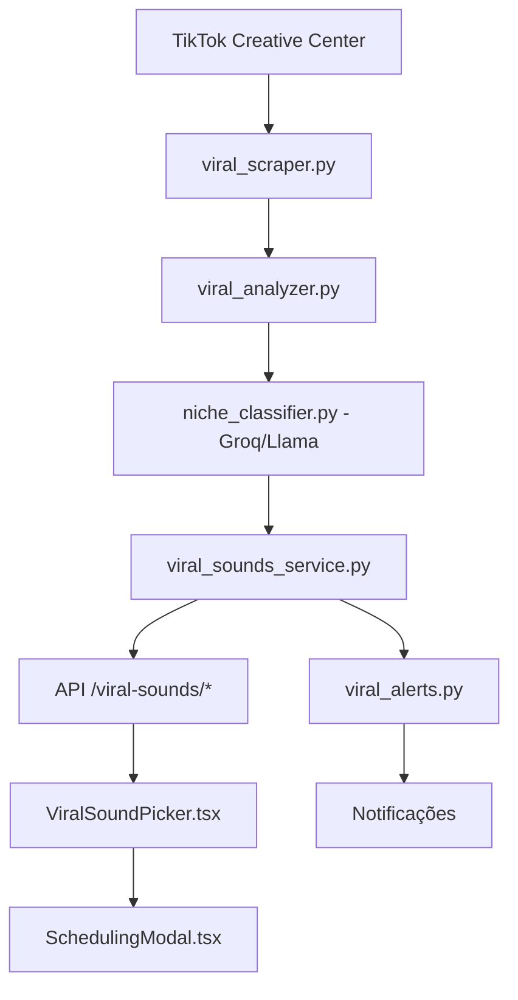

# 📋 Synapse - Base de Conhecimento Linear (Todas as Issues Completas)

**Total de issues catalogadas:** 89

> **Observação sobre o conteúdo:** Este documento contém o detalhamento técnico **EXAUSTIVO E COMPLETO** de todas as issues do projeto, sem truncamentos da API.

---

## 🚧 In Progress (1 issues)

---

### [SYN-36] 🎨 Frontend: Global UI Redesign & Design System Infra (Neo-Glass)
- **Prioridade:** High
- **Projeto/Módulo:** 🎛️ Central de Comando
- **Tags:** Frontend, Polimento
- **URL:** [Ver no Linear](https://linear.app/synapsefactory/issue/SYN-36/frontend-global-ui-redesign-and-design-system-infra-neo-glass)

#### 📄 Descritivo Técnico

# Redesign Global de Interface & Design System

Unificação da transformação visual "Neo-Glass" com a implementação da infraestrutura de Design System.

## 🎨 Escopo Visual (Aplicação Principal - Porta 3000)

Transformar toda a plataforma (Apple Vision Pro encontra Blade Runner).

### Referências Visuais

* **Vidro Profundo**: Fundo escuro semitransparente (`bg-[#0c0c0c]/80`) com desfoque pesado (`backdrop-blur-2xl`).
* **Geometria "Squircle"**: B… (truncated, use `get_issue` for full description)

<br/>

## 📥 Backlog (26 issues)

---

### [SYN-40] 🧠 AI: Auto-Mix em Lote (Músicas Virais Únicas)
- **Prioridade:** Medium
- **Projeto/Módulo:** 📅 Agendamento
- **Tags:** Backend, AI/ML
- **URL:** [Ver no Linear](https://linear.app/synapsefactory/issue/SYN-40/ai-auto-mix-em-lote-musicas-virais-unicas)

#### 📄 Descritivo Técnico

**Solicitação do Usuário**: "Adicione suporte para que cada video na fila seja uma musica diferente."

**Tarefas**:

* Atualizar `BatchManager.create_batch` para aceitar `mix_viral_sounds=True` (ou flag similar).
* Em `batch.py`, injetar lógica para buscar `trend_checker.get_cached_trends()`.
* Distribuir esses sons em rodízio (round-robin) entre os itens do lote em vez de usar um único `sound_id`.
* Atualizar modelo `CreateBatchRequest`.

---

… (truncated, use `get_issue` for full description)

<br/>

### [SYN-44] 📚 Testes: Corrigir Contexto de Mocks do Router no Storybook
- **Prioridade:** None
- **Projeto/Módulo:** 🏗️ Infrastructure
- **Tags:** Frontend, Testes
- **URL:** [Ver no Linear](https://linear.app/synapsefactory/issue/SYN-44/testes-corrigir-contexto-de-mocks-do-router-no-storybook)

#### 📄 Descritivo Técnico

## Problema

Componentes do Storybook usando `next/navigation` (como `SplashScreen` e Sidebar) estão mostrando erros "NextjsRouterMocksNotAvailable".

## Tarefa

* Configurar `storybook-addon-next-router` ou verificar parâmetros `nextjs.appDirectory` em `preview.ts`/`main.ts`.
* Garantir que todas as stories usando `useRouter` tenham os decorators adequados.

---

## 🔧 Technical Blueprint & Paths (AI Augmented)

* **Priority Status:** Low. Fixes… (truncated, use `get_issue` for full description)

<br/>

### [SYN-48] ♻️ Frontend: Extract Approval Modal Logic from page.tsx
- **Prioridade:** None
- **Projeto/Módulo:** 🎛️ Central de Comando
- **Tags:** Frontend, Improvement
- **URL:** [Ver no Linear](https://linear.app/synapsefactory/issue/SYN-48/frontend-extract-approval-modal-logic-from-pagetsx)

#### 📄 Descritivo Técnico

**Oportunidade de Melhoria:**

Notei que o `page.tsx` está ficando muito grande e complexo, acumulando responsabilidades (Dashboard, Upload, Fila, Agendamento).

Especificamente, a lógica do **Modal de Aprovação** envolve:

1. Gerenciamento de estado (`showApprovalModal`, `selectedVideo`, `batchFiles`).
2. Lógica de transformação de dados (`useMemo` para `approvalPreload`).
3. Callbacks de sucesso complexos (`handlePostApprovalSuccess`).

**Prop… (truncated, use `get_issue` for full description)

<br/>

### [SYN-50] ⚙️ Feature: Implementar Página de Configurações Globais (Synapse Config)
- **Prioridade:** None
- **Projeto/Módulo:** 🎛️ Central de Comando
- **Tags:** Frontend, Feature
- **URL:** [Ver no Linear](https://linear.app/synapsefactory/issue/SYN-50/feature-implementar-pagina-de-configuracoes-globais-synapse-config)

#### 📄 Descritivo Técnico

Implementar uma Página de Configurações Globais centralizada no frontend (`/settings`). Esta página substitui o placeholder atual 'Em Breve'.

**Propósito:**
Fornecer uma interface única para gerenciar segredos da aplicação, comportamentos padrão e saúde do sistema sem precisar modificar código fonte ou variáveis de ambiente diretamente.

**Status Atual:**

* ✅ Placeholder criado para evitar erro 404.
* 🚧 Funcionalidades reais (API Keys, etc) ai… (truncated, use `get_issue` for full description)

<br/>

### [SYN-51] 📱 Frontend: UI Responsiva (Split-Screen) & Sidebar Retrátil
- **Prioridade:** None
- **Projeto/Módulo:** 🎛️ Central de Comando
- **Tags:** Frontend, Polimento
- **URL:** [Ver no Linear](https://linear.app/synapsefactory/issue/SYN-51/frontend-ui-responsiva-split-screen-and-sidebar-retratil)

#### 📄 Descritivo Técnico

## 📱 Responsividade & Sidebar Retrátil

**Solicitação do Usuário:**
"Eu utilizo na maioria das vezes as janelas divididas para gerenciar o projeto... quero uma sidebar retroativa e expansiva."

**Objetivos:**

1. **Sidebar Expansiva/Retrátil:**
   * Modo "Mini" (Apenas ícones).
   * Modo "Full" (Ícones + Texto).
   * Botão de toggle ou hover behavior.
   * Estilo "Retro/Cyberpunk" conforme Design System.
2. **Responsividade (Split-Screen):**
   … (truncated, use `get_issue` for full description)

<br/>

### [SYN-52] 🛑 Bug: Confirmação de Exclusão de Perfil
- **Prioridade:** None
- **Projeto/Módulo:** 🎛️ Central de Comando
- **Tags:** Frontend, Bug
- **URL:** [Ver no Linear](https://linear.app/synapsefactory/issue/SYN-52/bug-confirmacao-de-exclusao-de-perfil)

#### 📄 Descritivo Técnico

## 🗑️ Confirmação de Exclusão de Perfil

**Solicitação do Usuário:**
"Não consigo excluir os perfis (de teste), adicione suporte para que abra um dialog de confirmação de exclusão."

**Objetivos:**

1. **Modal de Confirmação:** Implementar um dialog (alert ou custom modal) ao clicar no botão de excluir perfil.
2. **Integração Backend:** Garantir que a chamada de API DELETE seja feita corretamente após confirmação.
3. **Feedback Visual:** Mostrar … (truncated, use `get_issue` for full description)

<br/>

### [SYN-54] ✨ Frontend: Melhorias de UX em Perfis (Undo, Bulk, Health)
- **Prioridade:** None
- **Projeto/Módulo:** 🎛️ Central de Comando
- **Tags:** Frontend, Feature
- **URL:** [Ver no Linear](https://linear.app/synapsefactory/issue/SYN-54/frontend-melhorias-de-ux-em-perfis-undo-bulk-health)

#### 📄 Descritivo Técnico

## 🚀 Melhorias de Gerenciamento de Perfil

**Solicitação do Usuário:**
"Implemente essas 3 oportunidades de melhoria: Undo via Toast, Bulk Actions e Status Visual."

**Escopo:**

1. **Undo via Toast:** Implementar exclusão otimista (remover da UI, mostrar toast com "Desfazer", e só enviar DELETE para API após timer ou confirmação final).
2. **Ações em Massa (Bulk Actions):** Checkboxes nos cards de perfil para Selecionar Tudo/Vários. Barra flutu… (truncated, use `get_issue` for full description)

<br/>

### [SYN-65] 🛡️ Feature: Robust Session Management & Integrated Repair
- **Prioridade:** None
- **Projeto/Módulo:** 👤 Perfis TikTok
- **Tags:** Backend, Feature
- **URL:** [Ver no Linear](https://linear.app/synapsefactory/issue/SYN-65/feature-robust-session-management-and-integrated-repair)

#### 📄 Descritivo Técnico

## Robust Session Management & Integrated Repair

### Contexto

Para resolver problemas recorrentes de expiração de sessão e detecção de bots pelo TikTok, implementamos um sistema robusto de gerenciamento de sessões.

### Implementação

1. **Contextos Persistentes (**`user_data_dir`):
   * O `browser.py` e `session_manager.py` foram atualizados para usar diretórios de dados persistentes.
   * Isso mantém os cookies, cache e fingerprint do navega… (truncated, use `get_issue` for full description)

<br/>

### [SYN-68] 🕵️ Feature: Studio Scanner - Monitor de Slots Agendados
- **Prioridade:** Urgent
- **Projeto/Módulo:** 📅 Agendamento
- **Tags:** Backend, Feature
- **URL:** [Ver no Linear](https://linear.app/synapsefactory/issue/SYN-68/feature-studio-scanner-monitor-de-slots-agendados)

#### 📄 Descritivo Técnico

## Contexto

Para suportar filas de 30+ videos com agendamento incremental (10 de cada vez), o sistema precisa de um monitor que verifique automaticamente quantos posts ainda estao agendados no TikTok Studio para cada perfil.

## Objetivo

Criar `core/studio_scanner.py` que abre o TikTok Studio em modo headless e conta quantos posts tem status "Agendado" ou "Scheduled" para cada perfil.

## Quando Roda

* Ao abrir a pagina `/scheduler` no fronte… (truncated, use `get_issue` for full description)

<br/>

### [SYN-69] 💾 Feature: Video Queue Persistence (SQLite Queue para 30+ videos)
- **Prioridade:** High
- **Projeto/Módulo:** 📅 Agendamento
- **Tags:** Backend, Feature
- **URL:** [Ver no Linear](https://linear.app/synapsefactory/issue/SYN-69/feature-video-queue-persistence-sqlite-queue-para-30-videos)

#### 📄 Descritivo Técnico

## Contexto

Para suportar filas de 30+ videos com agendamento incremental (10 de cada vez), o sistema precisa persistir a lista completa de videos e seu estado (na fila, agendado, postado) entre sessoes.

## Objetivo

Criar tabela `video_queue` no SQLite e modelo SQLAlchemy correspondente para rastrear a fila completa de videos de cada perfil.

## Schema Proposto

```sql
CREATE TABLE video_queue (
    id INTEGER PRIMARY KEY AUTOINCREMENT,
    p… (truncated, use `get_issue` for full description)

<br/>

### [SYN-70] 🐛 Fix: Session Fingerprinting - User-Agent Lock por Perfil
- **Prioridade:** High
- **Projeto/Módulo:** 👤 Perfis TikTok
- **Tags:** Backend, Improvement
- **URL:** [Ver no Linear](https://linear.app/synapsefactory/issue/SYN-70/fix-session-fingerprinting-user-agent-lock-por-perfil)

#### 📄 Descritivo Técnico

## Contexto

O problema de "Session Expired" ocorre frequentemente porque diferentes sessoes do Playwright usam User-Agents diferentes, fazendo o TikTok invalidar cookies por inconsistencia de fingerprint do dispositivo.

## Objetivo

Implementar Session Fingerprinting: salvar `user_agent`, `viewport_width`, `viewport_height` e outros metadados do navegador no momento da criacao da sessao, e reutiliza-los em TODOS os uploads subsequentes para aq… (truncated, use `get_issue` for full description)

<br/>

### [SYN-71] 🐛 Fix: Smart Verification - Anti Falsos Negativos na Validacao de Sessao
- **Prioridade:** High
- **Projeto/Módulo:** 👤 Perfis TikTok
- **Tags:** Backend, Improvement
- **URL:** [Ver no Linear](https://linear.app/synapsefactory/issue/SYN-71/fix-smart-verification-anti-falsos-negativos-na-validacao-de-sessao)

#### 📄 Descritivo Técnico

## Contexto

Atualmente a verificacao de sessao do Synapse faz apenas uma tentativa de navegacao simples, gerando muitos falsos negativos (sessao valida marcada como expirada) quando o TikTok exibe telas de confirmacao, captcha ou layout alternativo.

## Objetivo

Implementar Smart Verification: uma logica de verificacao em multiplos passos que distingue entre "sessao realmente invalida" e "TikTok mostrando uma tela intermediaria".

## Logica Pr… (truncated, use `get_issue` for full description)

<br/>

### [SYN-72] 🧹 Infra: Limpeza de Scripts Debug na Raiz do Backend
- **Prioridade:** Low
- **Projeto/Módulo:** 🏗️ Infrastructure
- **Tags:** Backend
- **URL:** [Ver no Linear](https://linear.app/synapsefactory/issue/SYN-72/infra-limpeza-de-scripts-debug-na-raiz-do-backend)

#### 📄 Descritivo Técnico

## Contexto

A raiz do `backend/` acumulou 30+ scripts de debug, verificacao e testes avulsos (`check_*.py`, `debug_*.py`, `test_*.py`). Isso polui o diretorio principal, dificulta navegacao e aumenta o risco de scripts antigos serem executados acidentalmente.

## Objetivo

Mover todos os scripts de debug/investigacao para `backend/scripts/debug/`, mantendo apenas arquivos essenciais na raiz.

## Regra a Aplicar (daqui para frente)

Conforme o C… (truncated, use `get_issue` for full description)

<br/>

### [SYN-73] 🧪 Testes: Smoke Test Automatico (Verificacao de Saude em menos de 30s)
- **Prioridade:** Medium
- **Projeto/Módulo:** 🏗️ Infrastructure
- **Tags:** Backend, Testes
- **URL:** [Ver no Linear](https://linear.app/synapsefactory/issue/SYN-73/testes-smoke-test-automatico-verificacao-de-saude-em-menos-de-30s)

#### 📄 Descritivo Técnico

## Contexto

Nao existe um mecanismo automatico para verificar se o sistema esta saudavel apos modificacoes. Isso aumenta o risco de regressions passarem despercebidos, especialmente apos modificacoes em `core/`.

## Objetivo

Criar `backend/scripts/smoke_test.sh` que roda em menos de 30 segundos e verifica os pontos criticos do sistema.

## Checks a Implementar

```bash
# 1. Backend respondendo
GET /health -> {"status": "healthy"}

# 2. Banco d… (truncated, use `get_issue` for full description)

<br/>

### [SYN-78] 🌌 Feature: Fila de Publicação Inteligente (Smart Queue)
- **Prioridade:** Medium
- **Projeto/Módulo:** 👁️ Factory Watcher
- **Tags:** Frontend, Feature
- **URL:** [Ver no Linear](https://linear.app/synapsefactory/issue/SYN-78/feature-fila-de-publicacao-inteligente-smart-queue)

#### 📄 Descritivo Técnico

## Contexto Modificado

Anteriormente pensado como um Kanban de aprovação manual, o fluxo agora será **100% automatizado**.
Como a automação gera múltiplos clipes por dia, nós não podemos flodar o TikTok (limite seguro de \~2 postagens/dia).

## Requisitos do Fluxo

1. **Ingestão Automática:** Quando o `editor.py` terminar de renderizar o `final_stitched.mp4`, ele NÃO aguardará aprovação humana.
2. **Fila Circular / Time-slots:** O vídeo entrará… (truncated, use `get_issue` for full description)

<br/>

### [SYN-79] 🌌 Feature: Scheduler PDD API (Calendário 3D)
- **Prioridade:** Medium
- **Projeto/Módulo:** 📅 Agendamento
- **Tags:** Backend, Frontend, Feature
- **URL:** [Ver no Linear](https://linear.app/synapsefactory/issue/SYN-79/feature-scheduler-pdd-api-calendario-3d)

#### 📄 Descritivo Técnico

A Grade Temporal necessita desenvolvimento de uma API cron em um modelo de Publicações. O frontend agora tem calendário para mostrar onde e quando vídeos serão postados.

---

## 🔧 Technical Blueprint & Paths (AI Augmented)

* **Priority Status:** Medium. Required to feed data to the new 3D temporal grid in the frontend.
* **Paths Front-End:** `frontend/app/scheduler/page.tsx`
* **Paths Back-End:** `backend/app/api/endpoints/auto_scheduler.py`
*… (truncated, use `get_issue` for full description)

<br/>

### [SYN-81] 🌌 Feature: Motor Oráculo V2
- **Prioridade:** Medium
- **Projeto/Módulo:** 🔮 Oracle
- **Tags:** AI/ML, Backend, Feature
- **URL:** [Ver no Linear](https://linear.app/synapsefactory/issue/SYN-81/feature-motor-oraculo-v2)

#### 📄 Descritivo Técnico

O input pede ideias de descoberta e tags profundas. Desenvolver um workflow integrando com Large Language Models na parte do python para devolver JSON para essa interface responder.

---

## 🔧 Technical Blueprint & Paths (AI Augmented)

* **Priority Status:** Medium. Required to feed dynamic context tags.
* **Paths Front-End:** `frontend/app/oracle/page.tsx`
* **Paths Back-End:** `backend/core/oracle_llm.py`, `backend/app/api/endpoints/oracle.py… (truncated, use `get_issue` for full description)

<br/>

### [SYN-82] 🌌 Feature: Cofre de Configurações Dinâmicas
- **Prioridade:** Low
- **Projeto/Módulo:** 🎛️ Central de Comando
- **Tags:** Backend, Frontend, Feature
- **URL:** [Ver no Linear](https://linear.app/synapsefactory/issue/SYN-82/feature-cofre-de-configuracoes-dinamicas)

#### 📄 Descritivo Técnico

API Keys de LLM e hardware limits rodam no `.env`. Construir CRUD para gerir essas configs via DB (settings table), persistidas, permitindo a rotação através da página de Configuração de Sistema.

---

## 🔧 Technical Blueprint & Paths (AI Augmented)

* **Priority Status:** Low. QoL for changing API keys in-flight without restarting uvicorn.
* **Paths Front-End:** `frontend/app/settings/page.tsx`
* **Paths Back-End:** `backend/core/config_manager… (truncated, use `get_issue` for full description)

<br/>

### [SYN-83] 🛰️ Feature: Sistema de Proxies por Perfil (Prevent Shadowban)
- **Prioridade:** High
- **Projeto/Módulo:** 🏗️ Infrastructure
- **Tags:** Backend, Feature
- **URL:** [Ver no Linear](https://linear.app/synapsefactory/issue/SYN-83/feature-sistema-de-proxies-por-perfil-prevent-shadowban)

#### 📄 Descritivo Técnico

## Contexto

Cada perfil automatizado terá seu bot específico rodando com `Playwright`. Para evitar Shadowban e rastros compartilhados, cada perfil deverá obrigatoriamente realizar requisições usando um Proxy específico daquele perfil, e não o IP root do servidor original.

## Requisitos

1. O banco de dados (SQLite) precisa armazenar os dados de host/porta/user/senha do Proxy atrelados diretamente a cada `Profile`.
2. O `browser.py` ou gerencia… (truncated, use `get_issue` for full description)

<br/>

### [SYN-85] 🔀 Frontend: Botão "Switch" (Inverter Ordem) na Vitrine de Vídeos
- **Prioridade:** Medium
- **Projeto/Módulo:** 🎛️ Central de Comando
- **Tags:** Frontend, Improvement
- **URL:** [Ver no Linear](https://linear.app/synapsefactory/issue/SYN-85/frontend-botao-switch-inverter-ordem-na-vitrine-de-videos)

#### 📄 Descritivo Técnico

## Contexto

Durante o processo de junção (stitching) de dois clipes para formar um vídeo de >60s na Twitch, a Inteligência Artificial muitas vezes seleciona os clipes corretamente, mas a ordem lógica ou de retenção fica invertida no resultado final (ex: o Clípe 2 deveria ser o Clípe 1).

## Requisito (Fluxo Tinder-Style)

Na interface da Vitrine ("Reservatório de Aprovação"), além dos botões:

* 🟢 Aprovar (Mandaria para a Fila de Publicação)
* … (truncated, use `get_issue` for full description)

<br/>

### [SYN-86] 🏭 Frontend: Unificacão da Factory UI e Adaptação Tinder-Style
- **Prioridade:** Medium
- **Projeto/Módulo:** 👁️ Factory Watcher
- **Tags:** Frontend, Feature
- **URL:** [Ver no Linear](https://linear.app/synapsefactory/issue/SYN-86/frontend-unificacao-da-factory-ui-e-adaptacao-tinder-style)

#### 📄 Descritivo Técnico

## Contexto da Análise (Factory / Pipeline Industrial)

Ao comparar a interface antiga (`dashboard_deprecated.tsx`) com o novo layout `Pipeline Industrial` gerado pelo Stitch, documentamos os seguintes pontos de arquitetura de UI/UX:

**1. O que tínhamos e precisamos resgatar (em nova UI)**

* Área de Drag & Drop para upload manual de vídeos.
* Seletor de Perfis (direcionamento do upload).
* Agendamento (Time Travel).

**2. O que o Stitch Trouxe… (truncated, use `get_issue` for full description)

<br/>

### [SYN-87] 🛰️ Frontend: Correções e Integrações da Tela do Clipper
- **Prioridade:** Medium
- **Projeto/Módulo:** 🎛️ Central de Comando
- **Tags:** Frontend, Backend, Improvement
- **URL:** [Ver no Linear](https://linear.app/synapsefactory/issue/SYN-87/frontend-correcoes-e-integracoes-da-tela-do-clipper)

#### 📄 Descritivo Técnico

## Contexto da Análise (Vigilância do Espaço Profundo)

Ao analisar a nova interface do `Clipper` introduzida pelo Stitch, levantamos os seguintes pontos de arquitetura de UI/UX e dependências do Backend:

**1. Melhorias e Adaptações de Backend (Requer API)**

* **Telemetria Real:** Os monitores de Carga de CPU e Fluxo de Rede precisam ser linkados a um WebSockets ou endpoint real (node_exporter ou backend metrics) para saírem do status de place… (truncated, use `get_issue` for full description)

<br/>

### [SYN-88] 👥 Frontend/Backend: Correções de UI da Node Wall e Bulk Endpoints
- **Prioridade:** High
- **Projeto/Módulo:** 👤 Perfis TikTok
- **Tags:** Frontend, Backend, Improvement
- **URL:** [Ver no Linear](https://linear.app/synapsefactory/issue/SYN-88/frontendbackend-correcoes-de-ui-da-node-wall-e-bulk-endpoints)

#### 📄 Descritivo Técnico

## Contexto da Análise (Node Wall / Perfis)

Com a recém introduzida arquitetura de UI do banco de perfis (Stitch Design), migramos o visual tradicional em cards para os hexágonos do `Node Wall`. A funcionalidade principal que isso destravou foi a de **Bulk Actions (Ações em Lote)**.
Podemos selecionar 10 perfis usando as caixas de seleção simultaneamente. Porém, a requisição HTTP dispara assincronamente as rotas um-para-um, sobrecarregando a re… (truncated, use `get_issue` for full description)

<br/>

### [SYN-90] 📈 Infra/Backend: Roteador de Logs WebSocket e Status Vital p/ Tela de Telemetria
- **Prioridade:** High
- **Projeto/Módulo:** 🏗️ Infrastructure
- **Tags:** Frontend, Backend, Feature
- **URL:** [Ver no Linear](https://linear.app/synapsefactory/issue/SYN-90/infrabackend-roteador-de-logs-websocket-e-status-vital-p-tela-de)

#### 📄 Descritivo Técnico

## Contexto da Análise (Metrics / Telemetria)

O redesign "Stitch" dessa tela redefiniu o propósito por trás dela. Antes, era uma página de resumos visuais (sucesso vs falha de upload da Ingestão de vídeos). Agora, trata-se de um painel estilo **Comando DevOps** (Monitoramento de Saúde de Servidor, Consumo de RAM, Logs).

## 1\. Requisições de Adaptação Backend

A interface exige uma transição maciça de telemetria em tempo-real para o frontend v… (truncated, use `get_issue` for full description)

<br/>

### [SYN-91] 🤖 Motor Oráculo: Restaurar Widgets Analíticos e Chat Backend
- **Prioridade:** High
- **Projeto/Módulo:** 🔮 Oracle
- **Tags:** Frontend, Backend, Improvement
- **URL:** [Ver no Linear](https://linear.app/synapsefactory/issue/SYN-91/motor-oraculo-restaurar-widgets-analiticos-e-chat-backend)

#### 📄 Descritivo Técnico

## Contexto da Análise (Motor Oráculo)

A transição para a linguagem visual Stitch substituiu o **Dashboard Analítico Completo (de 5 abas, gráficos pesados e IA)** do Oracle por uma Tela de Conversão Central e misteriosa ("Iniciar Sequência").

Isso deixou a UI estéril para análises profundas.

## 1\. Requisições de Adaptação Backend + UX

A entrada cinematográfica deve permanecer a mesma (UX 10/10), porém, precisamos restaurar a capacidade anal… (truncated, use `get_issue` for full description)

<br/>

### [SYN-93] 🛡️ Infra: Painel de Gerenciamento de Proxies e Fingerprints p/ Perfis
- **Prioridade:** Medium
- **Projeto/Módulo:** 📅 Agendamento
- **Tags:** Backend
- **URL:** [Ver no Linear](https://linear.app/synapsefactory/issue/SYN-93/infra-painel-de-gerenciamento-de-proxies-e-fingerprints-p-perfis)

#### 📄 Descritivo Técnico

## Oportunidade de Funcionalidade: Gerenciador de Proxies e Fingerprints

Foi sugerida a criação de um módulo no painel de Configurações (Core Calibration) dedicado a **Gerenciar Proxies e Fingerprints de Navegador**, permitindo o vínculo direto com a tela de Perfis (Profiles).

### Requisitos Cascatas propostos:

1. **Painel de Proxies (Configurações):**
   * CRUD de Proxies (HTTP/SOCKS5 com autenticação).
   * Sistema de "Test Connection" visu… (truncated, use `get_issue` for full description)

<br/>

## ✅ Done (54 issues)

---

### [SYN-10] 🔍 Oracle V2: SEO & Discovery
- **Prioridade:** High
- **Projeto/Módulo:** 🔮 Oracle
- **Tags:** Feature, AI/ML, Testes
- **URL:** [Ver no Linear](https://linear.app/synapsefactory/issue/SYN-10/oracle-v2-seo-and-discovery)

#### 📄 Descritivo Técnico

## 🔍 Oracle V2: SEO & Discovery

### Contexto

Módulo do Oracle V2 focado em análise de SEO e descoberta de oportunidades de conteúdo para maximizar alcance orgânico.

---

### 🎯 Objetivo

Identificar oportunidades de SEO no TikTok através de análise de hashtags, keywords e content gaps.

---

### ✅ Funcionalidades Implementadas

| Feature | Descrição | Status |
| -- | -- | -- |
| Hashtags Trending | Scraping do Creative Center | ✅ |
| Keywords … (truncated, use `get_issue` for full description)

<br/>

### [SYN-11] 📊 Oracle V2: Deep Analytics
- **Prioridade:** Medium
- **Projeto/Módulo:** 🔮 Oracle
- **Tags:** Feature, AI/ML, Testes
- **URL:** [Ver no Linear](https://linear.app/synapsefactory/issue/SYN-11/oracle-v2-deep-analytics)

#### 📄 Descritivo Técnico

## 📊 Oracle V2: Deep Analytics

### Contexto

Módulo de analytics profundo do Oracle, fornecendo insights avançados sobre performance de conteúdo.

---

### 🎯 Objetivo

Transformar dados brutos do TikTok em insights acionáveis através de análise profunda de métricas.

---

### ✅ Funcionalidades Implementadas

| Feature | Descrição | Status |
| -- | -- | -- |
| Análise de retenção | Curva de retenção por segundo do vídeo | ✅ |
| Heatmap de engaja… (truncated, use `get_issue` for full description)

<br/>

### [SYN-12] 🧪 Teste de Fluxo Completo End-to-End (E2E)
- **Prioridade:** Medium
- **Projeto/Módulo:** 🏗️ Infrastructure
- **Tags:** Testes, Frontend
- **URL:** [Ver no Linear](https://linear.app/synapsefactory/issue/SYN-12/teste-de-fluxo-completo-end-to-end-e2e)

#### 📄 Descritivo Técnico

## 🧪 Teste de Fluxo Completo End-to-End

### Contexto

Para garantir a estabilidade do sistema antes do lançamento, precisamos de um conjunto de testes que cubra o "caminho feliz" do início ao fim.

**Phase 1: Smoke Test (✅ Done)**

* Validado via Docker

**Phase 2: Expansion Pack (✅ Done)**

* Pipeline CI/CD: `.github/workflows/ci.yml`
* Regressão Visual: `visual-regression.spec.ts`
* Chaos Monkey: `chaos-monkey.spec.ts`
* Type Check script no … (truncated, use `get_issue` for full description)

<br/>

### [SYN-13] 🔮 The Oracle (Cérebro Estratégico do Synapse)
- **Prioridade:** Urgent
- **Projeto/Módulo:** 🔮 Oracle
- **Tags:** Feature, AI/ML, Backend
- **URL:** [Ver no Linear](https://linear.app/synapsefactory/issue/SYN-13/the-oracle-cerebro-estrategico-do-synapse)

#### 📄 Descritivo Técnico

## 🔮 The Oracle - Cérebro Estratégico do Synapse

### Visão Geral

O Oráculo é o **Consultor de Crescimento Autônomo** do Synapse. Usa dados reais do TikTok + IA para prescrever ações de viralidade.

---

### Stack Técnica (Atualizada 2026)

| Componente | Tecnologia |
| -- | -- |
| AI Core | Groq Llama 3.3 70B |
| Vision | **Groq Llama 4 Scout** (17B) |
| Scraping | Playwright (stealth mode) |
| Backend | Python FastAPI |
| Frontend | Next.js 1… (truncated, use `get_issue` for full description)

<br/>

### [SYN-14] ✅ Oracle V2: Automation Suite
- **Prioridade:** High
- **Projeto/Módulo:** 🔮 Oracle
- **Tags:** Feature, AI/ML
- **URL:** [Ver no Linear](https://linear.app/synapsefactory/issue/SYN-14/oracle-v2-automation-suite)

#### 📄 Descritivo Técnico

## ✅ Oracle V2: Automation Suite

### Status: ✅ Implementado

### Contexto

Suite de automação para executar análises recorrentes sem intervenção humana.

---

### ⚙️ Funcionalidades Implementadas (Backend)

| Componente | Função |
| -- | -- |
| `OracleAutomator` | Loop assíncrono que roda em background |
| `Auto Audit` | Verifica a cada 1h se algum perfil precisa de auditoria (regra: > 7 dias desde a última) |
| `Background Worker` | Integrado n… (truncated, use `get_issue` for full description)

<br/>

### [SYN-15] 💬 Sentiment Pulse (Oracle Expansion)
- **Prioridade:** High
- **Projeto/Módulo:** 🔮 Oracle
- **Tags:** Feature, AI/ML
- **URL:** [Ver no Linear](https://linear.app/synapsefactory/issue/SYN-15/sentiment-pulse-oracle-expansion)

#### 📄 Descritivo Técnico

## 💬 Sentiment Pulse (Oracle Expansion)

### Contexto

Expansão do Oracle para análise de sentimento dos comentários.

### Status

🧪 **Em testes finais**

### Funcionalidades Planejadas

* Extração dos últimos 50 comentários
* Classificação via Groq LLM (Positivo/Negativo/Neutro)
* Identificação de tópicos principais
* Estratégias de resposta:
  * **Negativo >40%:** Sugerir legendas polêmicas
  * **Positivo >80%:** Sugerir CTAs de crescimento

#… (truncated, use `get_issue` for full description)

<br/>

### [SYN-17] 📉 Oracle V2.1: Verificação de Tendências Reais (Scraper)
- **Prioridade:** High
- **Projeto/Módulo:** 🔮 Oracle
- **Tags:** Feature, AI/ML, Backend
- **URL:** [Ver no Linear](https://linear.app/synapsefactory/issue/SYN-17/oracle-v21-verificacao-de-tendencias-reais-scraper)

#### 📄 Descritivo Técnico

## 📉 Oracle V2.1: Real-World Trend Check

### Status: ✅ Implementado

---

### Arquivos Criados

| Arquivo | Descrição |
| -- | -- |
| `core/oracle/trend_checker.py` | Módulo principal com TrendChecker class |

### Endpoints Criados

| Método | Endpoint | Descrição |
| -- | -- | -- |
| GET | `/api/v1/oracle/trends` | Cache de trends (sem scraping) |
| POST | `/api/v1/oracle/trends/fetch` | Busca trends do Creative Center |
| POST | `/api/v1/orac… (truncated, use `get_issue` for full description)

<br/>

### [SYN-18] 💓 Sentiment Pulse (Nova Implementação)
- **Prioridade:** High
- **Projeto/Módulo:** 🔮 Oracle
- **Tags:** Feature, AI/ML, Backend
- **URL:** [Ver no Linear](https://linear.app/synapsefactory/issue/SYN-18/sentiment-pulse-nova-implementacao)

#### 📄 Descritivo Técnico

## 💬 Sentiment Pulse

### Status: ✅ Implementado

---

### Arquivos Criados

| Arquivo | Descrição |
| -- | -- |
| `core/oracle/sentiment_pulse.py` | Módulo principal com SentimentPulse class |

### Endpoints Criados

| Método | Endpoint | Descrição |
| -- | -- | -- |
| POST | `/api/v1/oracle/sentiment/profile/{username}` | Analisa comentários do perfil |
| POST | `/api/v1/oracle/sentiment/video` | Analisa comentários de vídeo específico |
| POS… (truncated, use `get_issue` for full description)

<br/>

### [SYN-19] 🎵 Audio Intelligence - Sistema de Música Viral Integrado (Plataforma-Wide)
- **Prioridade:** Medium
- **Projeto/Módulo:** 🧠 AI/ML Core
- **Tags:** Feature, AI/ML
- **URL:** [Ver no Linear](https://linear.app/synapsefactory/issue/SYN-19/audio-intelligence-sistema-de-musica-viral-integrado-plataforma-wide)

#### 📄 Descritivo Técnico

## 🎵 Audio Intelligence - Sistema de Música Viral Integrado

### Contexto

Sistema de inteligência de áudio **integrado em toda a plataforma**, não apenas no agendamento. A detecção e sugestão de música viral ocorre:

1. **No Upload** - Sugestão automática após upload do vídeo ✅
2. **No Agendamento** - Seleção/troca antes de agendar (via ViralSoundPicker)
3. **No Oracle** - Análise de compatibilidade áudio-visual
4. **Na Ingestão** - Enrichment automático com sugestão de áudio

---

### 🏛️ Arquitetura Implementada

```
┌─────────────────────────────────────────────────────────────┐
│                   Audio Intelligence Core                    │
├─────────────────────────────────────────────────────────────┤
│  ┌──────────────────────────────────────────────────────┐  │
│  │              audio_intelligence.py                     │  │
│  │  - suggest_music(video_path) → Top 3 músicas          │  │
│  │  - analyze_compatibility(video, sound) → Score        │  │
│  │  - find_sync_point(video, sound) → Timestamp          │  │
│  │  - get_trending_for_niche(niche) → Lista trending     │  │
│  │  - get_quick_suggestion() → Sugestão rápida           │  │
│  └──────────────────────────────────────────────────────┘  │
│                            ↓                                 │
│       ┌─────────────────────────────────────┐               │
│       │       viral_sounds_service.py        │               │
│       └─────────────────────────────────────┘               │
└─────────────────────────────────────────────────────────────┘
```

---

### ✅ Funcionalidades Implementadas

| Feature | Status | Descrição | Integração |
| -- | -- | -- | -- |
| Detecção de trends | ✅ | Via viral_sounds_service | Core |
| Análise de compatibilidade | ✅ | Score + recomendação | Core |
| Sugestão de timestamps | ✅ | Ponto ideal de sync | Core |
| **Integração Upload** | ✅ | Sugestão automática no upload | Frontend |
| AudioSuggestionCard | ✅ | Componente premium | Frontend |

---

### 📁 Arquivos Criados/Modificados

| Arquivo | Ação | Descrição |
| -- | -- | -- |
| `core/audio_intelligence.py` | ✅ Criado | Módulo core de inteligência |
| `app/api/endpoints/audio.py` | ✅ Criado | Endpoints REST |
| `app/main.py` | ✅ Modificado | Router registrado |
| `frontend/components/AudioSuggestionCard.tsx` | ✅ Criado | Card premium de sugestão |
| `frontend/app/page.tsx` | ✅ Modificado | Integração pós-upload |

---

### Endpoints Implementados

| Método | Endpoint | Descrição |
| -- | -- | -- |
| POST | `/api/v1/audio/suggest` | ✅ Sugestão de música para vídeo |
| POST | `/api/v1/audio/compatibility` | ✅ Score de compatibilidade |
| GET | `/api/v1/audio/trending/{niche}` | ✅ Trending por nicho |
| GET | `/api/v1/audio/quick-suggest` | ✅ Sugestão rápida para pipelines |

---

### 🔗 Relacionado

* Evolui: [SYN-6](https://linear.app/synapsefactory/issue/SYN-6/seletor-de-musica-viral-agendamento) (Seletor de Música Viral)
* Evolui: [SYN-25](https://linear.app/synapsefactory/issue/SYN-25/sistema-de-selecao-de-musica-viral-ia-de-deteccao) (Sistema de Música Viral)
* Usa: Viral Sounds Service (existente)

<br/>

### [SYN-20] 📊 Lógica Central do Deep Analytics (Métricas)
- **Prioridade:** Medium
- **Projeto/Módulo:** 🎛️ Central de Comando
- **Tags:** Feature, Backend, Frontend
- **URL:** [Ver no Linear](https://linear.app/synapsefactory/issue/SYN-20/logica-central-do-deep-analytics-metricas)

#### 📄 Descritivo Técnico

## 📦 Smart Batch Manager - Sistema de Upload em Lote Integrado

### Contexto

Sistema de gerenciamento de uploads em lote com distribuição inteligente **integrado em toda a plataforma**.

O Batch Manager está disponível em:

1. **Central de Comando** - Upload rápido de múltiplos vídeos ✅
2. **Agendamento** - Distribuição inteligente com preview ✅
3. **Ingestão** - Processing pipeline para batch
4. **Factory Watcher** - Monitoramento de batch job… (truncated, use `get_issue` for full description)

<br/>

### [SYN-21] 🔗 Integrar Tavily MCP (SEO & Discovery)
- **Prioridade:** Low
- **Projeto/Módulo:** 🔮 Oracle
- **Tags:** Feature, AI/ML, Testes
- **URL:** [Ver no Linear](https://linear.app/synapsefactory/issue/SYN-21/integrar-tavily-mcp-seo-and-discovery)

#### 📄 Descritivo Técnico

## 🔗 Integrar Tavily MCP (SEO & Discovery)

### Contexto

Integração com Tavily MCP para melhorar capacidades de SEO e descoberta de conteúdo em tempo real.

---

### 🎯 Objetivo

Usar Tavily como fonte adicional de dados de pesquisa web para enriquecer as análises do Oracle:

* Pesquisa de tendências atuais
* Análise de concorrência por nicho
* Discovery de hashtags emergentes
* Validação de trends com dados externos

---

### 🏛️ Arquitetura Prop… (truncated, use `get_issue` for full description)

<br/>

### [SYN-25] 🎵 Sistema de Seleção de Música Viral + IA de Detecção
- **Prioridade:** High
- **Projeto/Módulo:** 📅 Agendamento
- **Tags:** Feature, AI/ML, Backend
- **URL:** [Ver no Linear](https://linear.app/synapsefactory/issue/SYN-25/sistema-de-selecao-de-musica-viral-ia-de-deteccao)

#### 📄 Descritivo Técnico

## 🎵 Sistema de Seleção de Música Viral + IA

> **TL;DR:** Sistema inteligente para seleção de músicas virais do TikTok com detecção de crescimento em tempo real, classificação por nicho via IA, e interface premium.

---

### 🎯 Contexto

**Problema Identificado:**
Usuários precisavam selecionar músicas trending para seus vídeos, mas o dropdown estático de categorias não refletia dados reais do TikTok nem oferecia inteligência sobre quais áudios estavam realmente em alta.

**Impacto Esperado:**

* 📈 **Engagement**: Músicas virais aumentam alcance dos vídeos
* 🎨 **UX**: Interface premium com dados inteligentes
* 🤖 **IA**: Classificação automática de nicho

---

### 🏛️ Arquitetura



**Complexity Score:** 7/10

---

### 🛠️ Stack + Dependências

| Layer | Technology | Justificativa |
| -- | -- | -- |
| Backend | FastAPI + Playwright | Scraping + API REST |
| AI/ML | Groq (Llama 3.3) | Classificação de nicho |
| Frontend | React + Headless UI | UI premium com animações |
| Cache | JSON local | Persistência de 30min |

---

### 📁 Code Changes

**Files Created:** 6 | **Files Modified:** 4

| File | Type | LOC | Descrição |
| -- | -- | -- | -- |
| `viral_sounds_service.py` | Backend | \~350 | Serviço integrado com scraper/analyzer/classifier |
| `viral_scraper.py` | Backend | \~300 | Scraper TikTok Creative Center |
| `viral_analyzer.py` | Backend | \~200 | Motor de análise com viral_score |
| `niche_classifier.py` | Backend | \~220 | Classificador via Groq |
| `viral_alerts.py` | Backend | \~280 | Sistema de alertas |
| `viral_sounds.py` | API | \~130 | Endpoints REST |
| `ViralSoundPicker.tsx` | Frontend | \~420 | UI Premium |
| `SchedulingModal.tsx` | Frontend | \~mod | Integração |
| `scheduler.py` | Backend | \~mod | sound_id/sound_title |
| `uploader_monitored.py` | Backend | \~mod | Busca por título |

---

### 🔌 API Endpoints

| Method | Endpoint | Descrição |
| -- | -- | -- |
| GET | `/api/v1/viral-sounds/trending` | Sons trending por categoria/nicho |
| GET | `/api/v1/viral-sounds/breakout` | Sons explodindo (score ≥ threshold) |
| GET | `/api/v1/viral-sounds/niches` | Lista de nichos disponíveis |
| GET | `/api/v1/viral-sounds/search` | Busca por título/artista |

---

### 🧪 Testing

**Coverage Target:** 85% | **Manual Tests:** ✅ Passed

#### Test Results

```
Sons: 5
  - APT. | Score: 95.0 | Status: exploding | Niche: music
  - Die With A Smile | Score: 88.0 | Status: exploding | Niche: music
  - Gata Only | Score: 82.0 | Status: rising | Niche: music
  - Blade Runner 2049 | Score: 78.0 | Status: rising | Niche: gaming
  - BIRDS OF A FEATHER | Score: 75.0 | Status: rising | Niche: music
```

#### Manual Validation

- [X] **Happy Path:** Seleção de música funciona, score correto
- [X] **UI Premium:** Badges, progress bars, filtros funcionando
- [X] **Integração:** Música selecionada aparece no scheduler

---

### 🎬 Visual Evidence

**Música selecionada no Scheduler:**

* Modal funcionando com card da música
* Score e status visíveis da UI

**UI Elements Validados:**

* 🔥 EXPLODING badges
* 📈 RISING badges
* Progress bars de viral_score
* Growth rate indicators (+143%)
* Filtros por nicho
* Live Data indicator

---

### 📊 Métricas

| Métrica | Valor |
| -- | -- |
| Viral Score Range | 0-100 |
| Cache TTL | 30 minutos |
| Nichos Suportados | 13 |
| Categorias | 5 (General, Dance, Tech, Meme, Lipsync) |

---

### ✅ Definition of Done

**Code:**

- [X] Implementação completa
- [X] Linting passou

**Tests:**

- [X] Backend testado via CLI
- [X] Frontend testado via navegador

**Features:**

- [X] Seletor de música viral
- [X] Scores e status de viralidade
- [X] Classificação por nicho
- [X] UI premium com animações
- [X] Sistema de alertas (base)

---

**Created:** 2026-01-20 | **Team:** SynapseFactory

<br/>

### [SYN-26] 📊 Deep Analytics: Implementação Completa (Curva + Heatmap)
- **Prioridade:** Medium
- **Projeto/Módulo:** 🔮 Oracle
- **Tags:** Feature, AI/ML, Backend
- **URL:** [Ver no Linear](https://linear.app/synapsefactory/issue/SYN-26/deep-analytics-implementacao-completa-curva-heatmap)

#### 📄 Descritivo Técnico

## 📊 Deep Analytics - Implementação Completa\\n\\n### Contexto\\n\\nO módulo Deep Analytics está descrito na issue SYN-11, mas a implementação atual é básica. Esta issue visa implementar as funcionalidades avançadas.\\n\\n---\\n\\n### 🎯 Objetivo\\n\\nCriar módulo completo de analytics profundo com métricas avançadas de performance.\\n\\n---\\n\\n### 📁 Arquivos Criados ✅\\n\\n| Arquivo | Descrição |\\n| -- | -- |\\n| `core/oracle/deep_analytics.p… (truncated, use `get_issue` for full description)

<br/>

### [SYN-27] 🔍 SEO Discovery - Endpoints Avançados (Keywords + Gaps)
- **Prioridade:** High
- **Projeto/Módulo:** 🔮 Oracle
- **Tags:** Feature, AI/ML, Backend
- **URL:** [Ver no Linear](https://linear.app/synapsefactory/issue/SYN-27/seo-discovery-endpoints-avancados-keywords-gaps)

#### 📄 Descritivo Técnico

## 🔍 SEO Discovery - Endpoints Avançados (Keywords + Gaps)

### Status: ✅ Implementado

### Contexto

O SEO Engine existia (`seo_engine.py`) mas faltavam endpoints específicos para keywords e content gaps.

---

### ✅ Endpoints Criados

| Método | Endpoint | Descrição |
| -- | -- | -- |
| GET | `/api/v1/oracle/seo/keywords/{niche}` | Keywords sugeridas por nicho (Broad/Specific/Trending) |
| POST | `/api/v1/oracle/seo/gaps` | Análise de content … (truncated, use `get_issue` for full description)

<br/>

### [SYN-28] 📊 Deep Analytics - Frontend Dashboard (Charts + Heatmap)
- **Prioridade:** High
- **Projeto/Módulo:** 🔮 Oracle
- **Tags:** Frontend, Feature
- **URL:** [Ver no Linear](https://linear.app/synapsefactory/issue/SYN-28/deep-analytics-frontend-dashboard-charts-heatmap)

#### 📄 Descritivo Técnico

## 🎨 Deep Analytics - Frontend Dashboard

### Contexto

A tab "Deep Analytics" existe no Oracle frontend, mas precisa de componentes visuais para exibir os dados.

---

### 🎯 Objetivo

Criar componentes visuais premium para exibição de analytics avançados.

---

### Componentes a Criar

| Componente | Descrição |
| -- | -- |
| `RetentionCurveChart.tsx` | Gráfico de curva de retenção |
| `EngagementHeatmap.tsx` | Heatmap de engajamento temporal |… (truncated, use `get_issue` for full description)

<br/>

### [SYN-29] 🔗 Integrar Smart Logic no Agendamento Individual
- **Prioridade:** High
- **Projeto/Módulo:** 📅 Agendamento
- **Tags:** Improvement, Backend
- **URL:** [Ver no Linear](https://linear.app/synapsefactory/issue/SYN-29/integrar-smart-logic-no-agendamento-individual)

#### 📄 Descritivo Técnico

## 🔗 Integração Smart Logic no create_event

### Contexto

O endpoint `POST /api/v1/scheduler/create` usa lógica própria (`scheduler_service.is_slot_available()`) ao invés do Smart Logic completo (`smart_logic.check_conflict()`).

Isso causa **inconsistência**: O batch schedule valida com Smart Logic mas o agendamento individual não.

---

### 🎯 Objetivo

Refatorar `create_event` para usar o mesmo motor de regras que o `batch_schedule`.

---

##… (truncated, use `get_issue` for full description)

<br/>

### [SYN-30] 🔗 Integrar Smart Logic na Ingestão (Sugestão de Horário)
- **Prioridade:** Medium
- **Projeto/Módulo:** 🏗️ Infrastructure
- **Tags:** Improvement, Backend
- **URL:** [Ver no Linear](https://linear.app/synapsefactory/issue/SYN-30/integrar-smart-logic-na-ingestao-sugestao-de-horario)

#### 📄 Descritivo Técnico

## 🔗 Integração Smart Logic na Ingestão

### Contexto

Conforme definido no SYN-9, o Smart Logic deveria ser usado na **Ingestão** para sugerir o melhor horário ao fazer upload.

Atualmente o `ingestion.py` não consome o Smart Logic.

---

### 🎯 Objetivo

Adicionar sugestão inteligente de horário no response do upload.

---

### 📁 Arquivos a Modificar

| Arquivo | Ação |
| -- | -- |
| `app/api/endpoints/ingestion.py` | Adicionar sugestão no uplo… (truncated, use `get_issue` for full description)

<br/>

### [SYN-31] 🔗 Integrar Smart Logic no Frontend (SchedulingModal + BatchUpload)
- **Prioridade:** High
- **Projeto/Módulo:** 🎛️ Central de Comando
- **Tags:** Improvement, Frontend
- **URL:** [Ver no Linear](https://linear.app/synapsefactory/issue/SYN-31/integrar-smart-logic-no-frontend-schedulingmodal-batchupload)

#### 📄 Descritivo Técnico

## 🔗 Integração Smart Logic no Frontend

### Contexto

O backend expõe endpoints de Smart Logic (`/api/v1/logic/*`) mas o frontend **não os consome**.

Os componentes `SchedulingModal.tsx` e `BatchUploadModal.tsx` não validam horários antes de submeter.

---

### 🎯 Objetivo

Consumir a API Smart Logic no frontend para:

1. **Validar** horário antes de submeter
2. **Exibir warnings** em tempo real
3. **Sugerir** horários ótimos

---

### 📁 Arquiv… (truncated, use `get_issue` for full description)

<br/>

### [SYN-32] 📦 Criar batch_manager.py Core Module
- **Prioridade:** High
- **Projeto/Módulo:** 🧠 AI/ML Core
- **Tags:** Feature, Backend
- **URL:** [Ver no Linear](https://linear.app/synapsefactory/issue/SYN-32/criar-batch-managerpy-core-module)

#### 📄 Descritivo Técnico

## 📦 Batch Manager Core Module

### Contexto

O SYN-20 (Smart Batch Manager) define que deveria existir um módulo `batch_manager.py` transversal, mas **ele não existe**.

O `scheduler.py` implementa batch inline (L109-220) ao invés de usar um módulo central reutilizável.

---

### 🎯 Objetivo

Criar módulo `core/batch_manager.py` para centralizar lógica de batch, permitindo reuso em:

* Scheduler (batch schedule)
* Ingestão (batch upload)
* Facto… (truncated, use `get_issue` for full description)

<br/>

### [SYN-33] [RFC] Migração de Arquitetura de Dados: JSON -> SQLite
- **Prioridade:** High
- **Projeto/Módulo:** 🏗️ Infrastructure
- **Tags:** Backend, Improvement
- **URL:** [Ver no Linear](https://linear.app/synapsefactory/issue/SYN-33/rfc-migracao-de-arquitetura-de-dados-json-sqlite)

#### 📄 Descritivo Técnico

## Contexto

Atualmente, o Synapse utiliza arquivos JSON (`profiles.json`, `schedule.json`) como camada de persistência. Embora funcional para protótipos, essa abordagem apresenta riscos de concorrência (race conditions), corrupção de dados em falhas de escrita e dificuldade em realizar queries complexas.

## Proposta Técnica (RFC)

Migrar a camada de dados para **SQLite**.

### Por que SQLite?

1. **Zero-Config & Serverless**: Mantém a simplici… (truncated, use `get_issue` for full description)

<br/>

### [SYN-34] Migrar Trends Cache para SQLite
- **Prioridade:** Medium
- **Projeto/Módulo:** N/A
- **Tags:** Backend
- **URL:** [Ver no Linear](https://linear.app/synapsefactory/issue/SYN-34/migrar-trends-cache-para-sqlite)

#### 📄 Descritivo Técnico

## Contexto

Durante a migração para SQLite (SYN-33), identificamos que o módulo `TrendChecker` (`core/oracle/trend_checker.py`) ainda utiliza um arquivo JSON (`trends.json`) para cache.

## Objetivo

Para manter a consistência da arquitetura e permitir queries cruzadas (ex: "Qual trend mais usamos?"), devemos migrar esse cache para uma tabela `trends` no SQLite.

## Tarefas

1. Criar modelo `Trend` em `models.py`.
2. Refatorar `TrendChecker` pa… (truncated, use `get_issue` for full description)

<br/>

### [SYN-35] 🚑 Critical Bug Hunt & Stabilization
- **Prioridade:** None
- **Projeto/Módulo:** N/A
- **URL:** [Ver no Linear](https://linear.app/synapsefactory/issue/SYN-35/critical-bug-hunt-and-stabilization)

#### 📄 Descritivo Técnico

## Contexto

Realizada uma bateria intensa de correções críticas e estabilização do sistema.

## Escopo

* **Backend Offline**: Fix `IndentationError` em `oracle.py` e Syntax Error em `ingestion.py`.
* **Frontend Crash**: Adicionado `Global Error Boundary` e corrigido `WebSocketContext` invalid hook.
* **UX**: Criada página `/upload` para Upload Manual (feature gap).
* **Oracle Async**: Implementado `run_in_threadpool` para evitar bloqueio do Ev… (truncated, use `get_issue` for full description)

<br/>

### [SYN-38] Implementing Analytics Aggregator
- **Prioridade:** High
- **Projeto/Módulo:** 🔮 Oracle
- **Tags:** Backend, Feature
- **URL:** [Ver no Linear](https://linear.app/synapsefactory/issue/SYN-38/implementing-analytics-aggregator)

#### 📄 Descritivo Técnico

## 🧠 Deep Analytics - Backend Support

### Contexto

O frontend do Deep Analytics (SYN-28) foi implementado com componentes visuais avançados ("Neo-Glass"), mas atualmente exibe:

* Dados zerados nos cards de KPI (endpoint existe mas não retorna dados).
* Dados mockados nos gráficos (Retention, Heatmap, Comparison).

### 🎯 Objetivo

Implementar a inteligência no backend (`AnalyticsAggregator`) para processar e servir dados reais.

### Tarefas

-… (truncated, use `get_issue` for full description)

<br/>

### [SYN-39] 📝 AI: Descrições de IA Aprimoradas (CTA + Tags Virais)
- **Prioridade:** High
- **Projeto/Módulo:** 👁️ Factory Watcher
- **Tags:** Backend, AI/ML
- **URL:** [Ver no Linear](https://linear.app/synapsefactory/issue/SYN-39/ai-descricoes-de-ia-aprimoradas-cta-tags-virais)

#### 📄 Descritivo Técnico

**Solicitação do Usuário**: "Adicione suporte também para que as descrições sejam escritas pela IA com as Hashtags virais corretas e o texto que faça sentido com o video e um CTA focando seguidores."

**Tarefas**:

* Atualizar prompt do `seo_engine.generate_content_metadata`.
* Impor instrução explícita de "CTA de Crescimento".
* Integrar tendências reais em cache do `trend_checker` no contexto do prompt se possível, ou refinar instruções para g… (truncated, use `get_issue` for full description)

<br/>

### [SYN-41] ⏱️ BRAIN-07: Validação de Frequência do Agendador
- **Prioridade:** Medium
- **Projeto/Módulo:** 📅 Agendamento
- **Tags:** Backend, Feature
- **URL:** [Ver no Linear](https://linear.app/synapsefactory/issue/SYN-41/brain-07-validacao-de-frequencia-do-agendador)

#### 📄 Descritivo Técnico

**Solicitação do Usuário**: "Quero que valide todo o suporte da frequencia de posts para saber se é funcional."

**Tarefas**:

* Criar `backend/scripts/test_scheduler_frequency.py`.
* Simular criação de Lote com "2x/Dia" (intervalo de 720 min) e "A cada 4h".
* Verificar se a saída `scheduled_time` alinha com os slots esperados.
* Verificar se a lógica `scheduler.find_next_available_slot` respeita os buffers (margens de segurança).

<br/>

### [SYN-42] 🎨 BRAIN-08: Mass Upload UI Overhaul & Feature Integration
- **Prioridade:** High
- **Projeto/Módulo:** 🎨 Design UI/UX
- **Tags:** Frontend
- **URL:** [Ver no Linear](https://linear.app/synapsefactory/issue/SYN-42/brain-08-mass-upload-ui-overhaul-and-feature-integration)

#### 📄 Descritivo Técnico

**User Request**: "cade a opção da descrição escrita por ia? e a mesma coisa para as musicas individuais para cada video na fila? tem como melhorar toda a UX/UI desse modal?"

**Tasks**:

* Refactor `MassUpload.tsx` to use "Neo-Glass" design system.
* Add "Auto-Mix" Toggle (`mix_viral_sounds`).
* Add "Smart Captions" visual indicator.
* Improve Frequency Slider UX.

<br/>

### [SYN-45] 🔗 Integrar Fila de Aprovação com Modal Universal
- **Prioridade:** None
- **Projeto/Módulo:** 📅 Agendamento
- **Tags:** Frontend, Feature
- **URL:** [Ver no Linear](https://linear.app/synapsefactory/issue/SYN-45/integrar-fila-de-aprovacao-com-modal-universal)

#### 📄 Descritivo Técnico

Integração da Fila de Aprovação com o novo Modal Universal (BatchUploadModal).

**Tarefas Concluídas:**

* Atualizado `page.tsx` para usar `BatchUploadModal` em `mode=\"batch\"` para aprovações.
* Configurado `initialPreload` para passar dados de vídeos pendentes.
* Corrigido crash no `BatchCaptionEditor` com arquivos remotos (usando `filename` em vez de `file.name`).
* Restaurada funcionalidade "Ver Detalhes" do `MetricsModal`.
* Implementado `… (truncated, use `get_issue` for full description)

<br/>

### [SYN-46] 🔄 Corrigir Re-render Infinito no Modal de Aprovação
- **Prioridade:** None
- **Projeto/Módulo:** 🎛️ Central de Comando
- **Tags:** Frontend, Bug
- **URL:** [Ver no Linear](https://linear.app/synapsefactory/issue/SYN-46/corrigir-re-render-infinito-no-modal-de-aprovacao)

#### 📄 Descritivo Técnico

**Bug:** O loop no Modal de Aprovação estava fazendo o editor reabrir infinitamente.
**Causa:** `initialPreload` estava sendo passado como um objeto literal instável em `page.tsx`, acionando a reinicialização do `BatchProvider` a cada renderização.
**Correção:** O objeto `initialPreload` foi envolvido em um `useMemo` para garantir estabilidade referencial.
**Verificação:** Lógica do código confirmada; verificação manual pendente devido à cota do navegador.

<br/>

### [SYN-47] 🐛 Corrigir ReferenceError na Lógica do Modal de Aprovação
- **Prioridade:** None
- **Projeto/Módulo:** 🎛️ Central de Comando
- **Tags:** Frontend, Bug
- **URL:** [Ver no Linear](https://linear.app/synapsefactory/issue/SYN-47/corrigir-referenceerror-na-logica-do-modal-de-aprovacao)

#### 📄 Descritivo Técnico

**Bug:** A aplicação travou com `ReferenceError: pendingVideoForApproval is not defined`.
**Causa:** Tentativa de usar uma variável de estado inexistente `pendingVideoForApproval` durante a correção do `useMemo`. A variável correta era `selectedVideo`.
**Correção:** Referências atualizadas em `page.tsx` para usar `selectedVideo` e `setSelectedVideo`.
**Status:** Corrigido e verificado via revisão de código.

<br/>

### [SYN-49] 🏗️ Padronizar Arquitetura de Modais nas páginas principais
- **Prioridade:** None
- **Projeto/Módulo:** 🎛️ Central de Comando
- **Tags:** Frontend, Improvement, Polimento
- **URL:** [Ver no Linear](https://linear.app/synapsefactory/issue/SYN-49/padronizar-arquitetura-de-modais-nas-paginas-principais)

#### 📄 Descritivo Técnico

**Oportunidade de Melhoria Identificada:**
Durante a correção de bugs de loop no Home e Scheduler, identificamos que a arquitetura de modais (especialmente `BatchUploadModal`) está fragmentada e usando múltiplas variáveis de estado independentes (`isModalOpen`, `isBatchModalOpen`, etc.), o que leva a código duplicado e potenciais conflitos.

**Ação Realizada (Scheduler & Home):**
Já unificamos o estado no `scheduler/page.tsx` e `page.tsx` para u… (truncated, use `get_issue` for full description)

<br/>

### [SYN-5] 🔗 Configuração da Integração API TikTok
- **Prioridade:** Medium
- **Projeto/Módulo:** 🏗️ Infrastructure
- **Tags:** Backend, Feature
- **URL:** [Ver no Linear](https://linear.app/synapsefactory/issue/SYN-5/configuracao-da-integracao-api-tiktok)

#### 📄 Descritivo Técnico

## 🔗 Configuração da Integração API TikTok

**Objetivo:**
Conectar o Synapse à API oficial do TikTok para publicação e analytics.

**Requisitos:**

1. **Autenticação:** OAuth2 flow.
2. **Tokens:** Refresh token rotation automatico.
3. **Permissões:** `video.upload`, `user.info.stats`.
4. **Client Wrapper:** Classe Python `TikTokClient`.

**Status:**
✅ Implementado (Tokens gerenciados, upload funcional).

<br/>

### [SYN-55] ✨ Profile Auto-Import & Hybrid Delete Flow
- **Prioridade:** None
- **Projeto/Módulo:** N/A
- **Tags:** Feature
- **URL:** [Ver no Linear](https://linear.app/synapsefactory/issue/SYN-55/profile-auto-import-and-hybrid-delete-flow)

#### 📄 Descritivo Técnico

## Implementação de Auto-Importação e Fluxo de Exclusão Híbrida

### Contexto

Melhoria na UX de gerenciamento de perfis, automatizando metadados e tornando a exclusão mais segura e fluida.

### Escopo

1. **Auto-Importação (Backend/Frontend):**
   * `POST /import` agora aceita label opcional.
   * `update_profile_metadata_async` busca username e avatar do TikTok automaticamente.
2. **Fluxo de Exclusão Híbrida:**
   * **Modal de Confirmação:** I… (truncated, use `get_issue` for full description)

<br/>

### [SYN-56] Bug: Avatar Incorreto, Cookies Incompativeis e Refresh All
- **Prioridade:** High
- **Projeto/Módulo:** N/A
- **Tags:** Frontend, Backend, Bug
- **URL:** [Ver no Linear](https://linear.app/synapsefactory/issue/SYN-56/bug-avatar-incorreto-cookies-incompativeis-e-refresh-all)

#### 📄 Descritivo Técnico

## Correcao de Bug: Avatar, Cookies e Refresh All

### Contexto

Usuario reportou que o avatar exibido no Synapse estava incorreto - mostrava o avatar do "Passport" (conta TikTok/ByteDance) em vez do avatar do perfil publico do TikTok. Alem disso, o botao "Refresh All" nao funcionava e nao dava feedback visual.

### Causa Raiz

**Quatro problemas identificados:**

1. **Cookies Incompativeis com Playwright:**
   * Os cookies exportados do TikTok … (truncated, use `get_issue` for full description)

<br/>

### [SYN-57] 🐛 Fix: Scheduler Reliability (Privacy, Timezone & Status)
- **Prioridade:** None
- **Projeto/Módulo:** N/A
- **URL:** [Ver no Linear](https://linear.app/synapsefactory/issue/SYN-57/fix-scheduler-reliability-privacy-timezone-and-status)

#### 📄 Descritivo Técnico

**Correções Realizadas (Hotfix):**

1. **Privacidade do TikTok:**
   * Corrigido Regex do seletor de privacidade (adicionado suporte a "Somente você").
   * Implementado fallback de navegação por teclado (ArrowDown + Enter).
   * Reordenado fluxo para definir privacidade *antes* da legenda.
2. **Bug de Fuso Horário (Timezone):**
   * `scheduler.cleanup_missed_schedules` estava comparando Hora Local (SP) com UTC, marcando itens futuros como expir… (truncated, use `get_issue` for full description)

<br/>

### [SYN-58] 🏗️ Tech Debt: Standardize Timezones & Unified Status Status
- **Prioridade:** None
- **Projeto/Módulo:** N/A
- **URL:** [Ver no Linear](https://linear.app/synapsefactory/issue/SYN-58/tech-debt-standardize-timezones-and-unified-status-status)

#### 📄 Descritivo Técnico

**Oportunidades de Melhoria Identificadas:**

1. **Padronização de Timezone (Risco Médio):**
   * Encontrado uso de `datetime.utcnow()` em `backend/core/session_manager.py` (linhas 392, 448, 512).
   * **Risco:** Se esses horários forem comparados com `scheduled_time` (que é Local SP), bugs de expiração ocorrerão.
   * **Ação:** Migrar tudo para `datetime.now(ZoneInfo("America/Sao_Paulo"))`.
2. **Unificação de Status (Enum):**
   * O backend usa… (truncated, use `get_issue` for full description)

<br/>

### [SYN-59] 🛡️ Improvement: Robust Schedule Editing & Error Handling
- **Prioridade:** None
- **Projeto/Módulo:** N/A
- **URL:** [Ver no Linear](https://linear.app/synapsefactory/issue/SYN-59/improvement-robust-schedule-editing-and-error-handling)

#### 📄 Descritivo Técnico

**Diagnosis Update:**
Confirmed that `handleEditEvent` in frontend performs a purely local update, preserving old status. If the backend executed the task (Completed) while the user was editing, the local update overwrites the time but keeps "Pending", causing a disconnect.

**Proposed Solution:**
The `PATCH /scheduler/{id}` endpoint should return the *fresh* state of the event (including current status). The Frontend `handleEditEvent` should up… (truncated, use `get_issue` for full description)

<br/>

### [SYN-6] 📝 Descrições Virais Geradas por IA (V1)
- **Prioridade:** Medium
- **Projeto/Módulo:** 👁️ Factory Watcher
- **Tags:** Backend, AI/ML
- **URL:** [Ver no Linear](https://linear.app/synapsefactory/issue/SYN-6/descricoes-virais-geradas-por-ia-v1)

#### 📄 Descritivo Técnico

## 📝 Descrições Virais Geradas por IA (V1)

**Objetivo:**
Usar LLM (Gemini/Groq) para gerar legendas e hashtags engajadoras.

**Funcionalidades:**

1. **Análise Visual:** (Opcional) Ver conteúdo do vídeo.
2. **Contexto:** Receber nome do arquivo e tags manuais.
3. **Output:** 3 variações de copy (Curta, Storytelling, Clickbait).
4. **Hashtags:** Inserir tags de nicho automaticamente.

**Status:**
✅ Implementado (SEO Engine v1).

<br/>

### [SYN-60] 🎨 UX: Otimização para Alto Volume (Agendamento & Batch)
- **Prioridade:** None
- **Projeto/Módulo:** N/A
- **Tags:** Frontend, Improvement
- **URL:** [Ver no Linear](https://linear.app/synapsefactory/issue/SYN-60/ux-otimizacao-para-alto-volume-agendamento-and-batch)

#### 📄 Descritivo Técnico

**Contexto:**
Para suportar usuários com alto volume de agendamentos (ex: 86 posts), a interface precisava de melhorias de escalabilidade visual.

**Melhorias Implementadas:**

1. **Agendamento em Lote (Modal):** Adicionado agrupamento por Datas com sticky headers, transformando lista plana em timeline organizada.
2. **Detalhes do Dia:** Unificada identidade visual (cores neon por perfil) para consistência com o Calendário.
3. **Sidebar de Lote:… (truncated, use `get_issue` for full description)

<br/>

### [SYN-61] Vision-Enhanced Metadata Generation
- **Prioridade:** None
- **Projeto/Módulo:** N/A
- **URL:** [Ver no Linear](https://linear.app/synapsefactory/issue/SYN-61/vision-enhanced-metadata-generation)

#### 📄 Descritivo Técnico

Integrate VisionFaculty into VoiceFaculty.generate_metadata to use visual context for title/caption generation.

<br/>

### [SYN-62] SenseFaculty Screenshot Analysis
- **Prioridade:** None
- **Projeto/Módulo:** N/A
- **URL:** [Ver no Linear](https://linear.app/synapsefactory/issue/SYN-62/sensefaculty-screenshot-analysis)

#### 📄 Descritivo Técnico

Enable SenseFaculty to capture screenshots during scraping and use VisionFaculty to analyze them for visual insights (aesthetics, layout, quality).

<br/>

### [SYN-63] Refactor: Remove Duplication VoiceFaculty vs SEO Engine
- **Prioridade:** None
- **Projeto/Módulo:** N/A
- **URL:** [Ver no Linear](https://linear.app/synapsefactory/issue/SYN-63/refactor-remove-duplication-voicefaculty-vs-seo-engine)

#### 📄 Descritivo Técnico

Consolidate duplicate SEO audit logic found in VoiceFaculty.audit_profile_seo and seo_engine.audit_profile. Aim for a single source of truth.

<br/>

### [SYN-64] Global Settings Page (Synapse Config)
- **Prioridade:** None
- **Projeto/Módulo:** N/A
- **URL:** [Ver no Linear](https://linear.app/synapsefactory/issue/SYN-64/global-settings-page-synapse-config)

#### 📄 Descritivo Técnico

Implement a centralized Global Settings Page (/settings) to manage system configurations, API keys, and system health.

* Backend: SettingsManager (JSON persistence), API access.
* Frontend: Neo-Glass UI with tabs for Integrations, System Defaults, and Logs.

<br/>

### [SYN-66] 📅 Frontend: Calendar Post Indicators
- **Prioridade:** Medium
- **Projeto/Módulo:** 📅 Agendamento
- **Tags:** Frontend, Improvement
- **URL:** [Ver no Linear](https://linear.app/synapsefactory/issue/SYN-66/frontend-calendar-post-indicators)

#### 📄 Descritivo Técnico

## Calendar UI - Visual Feedback for Scheduled Posts

### Problem

The Scheduler Calendar view does not show any visual indicators (dots, counts) for days that have scheduled posts in the queue.
The "Ver Fila" (View Queue) list correctly shows pending items (e.g., 78 items), but the calendar grid appears empty.

### Proposal

1. Add a dot or counter to the day cells in the Calendar component.
2. Ensure it syncs with the same data source as the Q… (truncated, use `get_issue` for full description)

<br/>

### [SYN-67] Feature: TikTok Studio Native Scheduler (Auto-Agendar)
- **Prioridade:** Urgent
- **Projeto/Módulo:** N/A
- **Tags:** Frontend, Backend, Feature
- **URL:** [Ver no Linear](https://linear.app/synapsefactory/issue/SYN-67/feature-tiktok-studio-native-scheduler-auto-agendar)

#### 📄 Descritivo Técnico

## TikTok Studio Native Scheduler - Implementado

### Backend (completo)

* `core/models.py`: Modelo `VideoQueue` para fila de agendamento
* `core/auto_scheduler.py`: Logica de calculo de slots, criacao de fila, agendamento em lote
* `app/api/endpoints/auto_scheduler.py`: Endpoints REST (create queue, get status, schedule batch, preview slots, cancel)
* `app/main.py`: Router registrado em `/api/v1/auto-scheduler`

### Frontend (completo)

* `Bat… (truncated, use `get_issue` for full description)

<br/>

### [SYN-7] 🧠 Plataforma Viva & Inteligente (Smart UX/UI)
- **Prioridade:** Medium
- **Projeto/Módulo:** 🎛️ Central de Comando
- **Tags:** Feature, Frontend, Polimento
- **URL:** [Ver no Linear](https://linear.app/synapsefactory/issue/SYN-7/plataforma-viva-and-inteligente-smart-uxui)

#### 📄 Descritivo Técnico

## 🧠 Plataforma Viva & Inteligente

### Contexto

Transformar a UI do Synapse em uma interface "viva" que reage ao estado do sistema em tempo real.

---

### Efeitos Implementados ✅

**Ambient Light System:**

```typescript
type SystemMood = 'idle' | 'processing' | 'success' | 'error';

// Cores por estado
const moodColors = {
  idle: 'hsl(240, 70%, 50%)',      // Azul calmo
  processing: 'hsl(280, 70%, 50%)', // Roxo pulsante
  success: 'hsl(14… (truncated, use `get_issue` for full description)

<br/>

### [SYN-74] 🚀 Frontend Integration: Formulário de Inserção de Target Real
- **Prioridade:** Urgent
- **Projeto/Módulo:** 🎛️ Central de Comando
- **Tags:** Quick Win, Frontend, Bug
- **URL:** [Ver no Linear](https://linear.app/synapsefactory/issue/SYN-74/frontend-integration-formulario-de-insercao-de-target-real)

#### 📄 Descritivo Técnico

## Contexto da Análise (Vigilância do Espaço Profundo - Clipper)

A página clássica do Clipper conversava de forma transparente com o Backend (`POST /api/v1/clipper/targets`), capturando e registrando os alvos. Após a modernização da interface com o design Stitch, a camada visual ("Neo-Glass") sobrepôs a camada lógica do formulário, transformando a barra de INPUT numa UI sem estado que não dispara eventos de mutação reais no backend.

## 1\. Req… (truncated, use `get_issue` for full description)

<br/>

### [SYN-75] 🚀 Frontend Integration: Visualização Dinâmica da Lista de Alvos
- **Prioridade:** High
- **Projeto/Módulo:** 🎛️ Central de Comando
- **Tags:** Frontend, Feature
- **URL:** [Ver no Linear](https://linear.app/synapsefactory/issue/SYN-75/frontend-integration-visualizacao-dinamica-da-lista-de-alvos)

#### 📄 Descritivo Técnico

A nova grade ALVOS DE RECONHECIMENTO ORBITAL possui mock data (Kai Cenat, Pokimane, etc). Precisa ser substituída pelo State real vindo do backend (GET `/api/v1/clipper/targets`), renderizando componentes baseados nesses dados dinamicamente.

<br/>

### [SYN-76] 🚀 Frontend Integration: Mecânica de Auto Refresh Nativa
- **Prioridade:** High
- **Projeto/Módulo:** 👁️ Factory Watcher
- **Tags:** Frontend, Improvement
- **URL:** [Ver no Linear](https://linear.app/synapsefactory/issue/SYN-76/frontend-integration-mecanica-de-auto-refresh-nativa)

#### 📄 Descritivo Técnico

Restabelecer hooks (`useSWR` ou polling com `useEffect`) para buscar atualizações dos jobs em background, mostrando progresso no painel da Fábrica e status na lista Clipper.

<br/>

### [SYN-77] 🌌 Feature: Central de Comando (Dashboard Analytics)
- **Prioridade:** High
- **Projeto/Módulo:** 🎛️ Central de Comando
- **Tags:** Backend, Frontend, Feature
- **URL:** [Ver no Linear](https://linear.app/synapsefactory/issue/SYN-77/feature-central-de-comando-dashboard-analytics)

#### 📄 Descritivo Técnico

O Dashboard Principal necessita de APIs para preencher os mostradores: Velocidade Orbital, KPIs de Clipes e Retenção, e tráfego em tempo real do pipeline. Desenvolver os endpoints backend para alimentar isso.

---

## 🔧 Technical Blueprint & Paths (AI Augmented)

* **Priority Status:** High. Home screen functionalities.
* **Paths Front-End:** `frontend/app/page.tsx`
* **Paths Back-End:** `backend/app/api/endpoints/dashboard.py`
* **Exact Actions… (truncated, use `get_issue` for full description)

<br/>

### [SYN-8] 🗑️ Remoção de Dados Simulados (Real World Integration)
- **Prioridade:** Medium
- **Projeto/Módulo:** 🏗️ Infrastructure
- **Tags:** Improvement, Backend
- **URL:** [Ver no Linear](https://linear.app/synapsefactory/issue/SYN-8/remocao-de-dados-simulados-real-world-integration)

#### 📄 Descritivo Técnico

## 🗑️ Remoção de Dados Simulados

### Contexto

Eliminar todos os dados "mockados" (hardcoded/simulados) do Frontend e conectar com endpoints reais do Backend.

### Áreas Afetadas

1. **Factory Watcher:** Reflete estado real do File System (`inputs/`, `processing/`)
2. **Métricas:** Gráficos usam histórico real (JSON/SQLite) ao invés de `Math.random()`
3. **Agendamento:** Slots ocupados vêm do `schedule.json` real

### Entregas

* ✅ Backend: Scan… (truncated, use `get_issue` for full description)

<br/>

### [SYN-84] 🛰️ Infra: Galeria Estática FastAPI e Garbage Collector (5-Day TTL)
- **Prioridade:** High
- **Projeto/Módulo:** 🏗️ Infrastructure
- **Tags:** Backend, Feature
- **URL:** [Ver no Linear](https://linear.app/synapsefactory/issue/SYN-84/infra-galeria-estatica-fastapi-e-garbage-collector-5-day-ttl)

#### 📄 Descritivo Técnico

## Arquitetura de Retenção de Vídeos (Asset Retention Policy)

O `editor.py` não deve sobrescrever um único `final_stitched.mp4` na raiz da pasta. Ele agora deve salvar os exports numa pasta dedicada (`backend/data/exports/`) com nomes em hash + job id.

### Requisitos:

1. **Mounting Estático no FastAPI:** O diretório `data/exports/` será exposto via URL estática, permitindo acesso nativo aos `.mp4` pelas tags `<video>` no frontend (ex: Factory… (truncated, use `get_issue` for full description)

<br/>

### [SYN-89] 📅 Frontend/Backend: Readaptar Lógicas Legadas e Drag/Drop do Scheduler
- **Prioridade:** Urgent
- **Projeto/Módulo:** 📅 Agendamento
- **Tags:** Frontend, Backend, Feature
- **URL:** [Ver no Linear](https://linear.app/synapsefactory/issue/SYN-89/frontendbackend-readaptar-logicas-legadas-e-dragdrop-do-scheduler)

#### 📄 Descritivo Técnico

## Contexto da Análise (Scheduler / Operações Temporais)

O novo design (Stitch) revolucionou a aba de agendamento incorporando um calendário em grid imersivo e uma "Doca de Preparação" lateral. Ao analisar a versão base legada (commit `e3c9cef`), concluímos que ela **já era um calendário robusto integrado à API**. A sobrescrita do design estático do Stitch ocultou temporariamente a lógica dos Modais (`ScheduledVideosModal`, `DayDetailsModal` e … (truncated, use `get_issue` for full description)

<br/>

### [SYN-9] 🧠 Smart Logic - Motor de Regras Inteligente (Plataforma-Wide)
- **Prioridade:** Medium
- **Projeto/Módulo:** 🧠 AI/ML Core
- **Tags:** Feature, Backend, AI/ML
- **URL:** [Ver no Linear](https://linear.app/synapsefactory/issue/SYN-9/smart-logic-motor-de-regras-inteligente-plataforma-wide)

#### 📄 Descritivo Técnico

## 🧠 Smart Logic - Motor de Regras Inteligente (Plataforma-Wide)

### Contexto

Sistema inteligente de regras **integrado em toda a plataforma**, não apenas no agendamento.

O Smart Logic é usado em:

1. **Agendamento** - Evitar conflitos de horário ✅
2. **Batch Manager** - Distribuir vídeos inteligentemente
3. **Ingestão** - Sugerir melhor horário ao fazer upload
4. **Central** - Validar antes de qualquer ação

---

### 🏛️ Arquitetura Implementada

```
┌─────────────────────────────────────────────────────────────┐
│                   Smart Logic Core                           │
├─────────────────────────────────────────────────────────────┤
│  ┌──────────────────────────────────────────────────────┐  │
│  │              smart_logic.py                            │  │
│  │  - check_conflict(profile, time) → ValidationResult   │  │
│  │  - suggest_slot(profile) → OptimalTimeSlot            │  │
│  │  - validate_batch(events) → Dict[ValidationResult]    │  │
│  │  - get_optimal_times(profile) → List[OptimalTimeSlot] │  │
│  │  - get_rules() → Dict                                  │  │
│  └──────────────────────────────────────────────────────┘  │
└─────────────────────────────────────────────────────────────┘
```

---

### ✅ Funcionalidades Implementadas

| Feature | Status | Descrição | Integração |
| -- | -- | -- | -- |
| Conflict Check | ✅ | Verifica conflito de horário | Scheduler, Batch |
| Slot Suggestion | ✅ | Sugere próximo slot livre | Scheduler |
| Intervalo Mínimo | ✅ | 2h entre posts | Core |
| Max por Dia | ✅ | Limite de 3 posts/dia | Core |
| Horário Bloqueado | ✅ | 02:00 - 06:00 | Core |
| Prime Time | ✅ | Score bonus para 19-23h | Core |
| Optimal Times | ✅ | Lista melhores horários | API |
| Validate Batch | ✅ | Valida múltiplos eventos | Batch |

---

### Regras de Negócio

| Regra | Valor |
| -- | -- |
| Intervalo mínimo | 2 horas |
| Posts por dia | Máximo 3 |
| Horário bloqueado | 02:00 - 06:00 |
| Prime time | 07-09h, 12-14h, 19-23h |

---

### 📁 Arquivos Criados

| Arquivo | Descrição |
| -- | -- |
| `core/smart_logic.py` | ✅ Motor de regras |
| `app/api/endpoints/logic.py` | ✅ Endpoints REST |
| `app/main.py` | ✅ Router registrado |

---

### Endpoints Implementados

| Método | Endpoint | Descrição |
| -- | -- | -- |
| GET | `/api/v1/logic/rules` | ✅ Retorna configuração |
| POST | `/api/v1/logic/check-conflict` | ✅ Verifica conflito |
| GET | `/api/v1/logic/suggest/{profile_id}` | ✅ Sugere slot |
| GET | `/api/v1/logic/optimal-times/{profile_id}` | ✅ Melhores horários |
| POST | `/api/v1/logic/validate-batch` | ✅ Valida batch |

---

### 🔗 Relacionado

* Bloqueia: [SYN-20](https://linear.app/synapsefactory/issue/SYN-20) (Smart Batch Manager)
* Usa: Schedule data
* Integra com: Oracle (para insights de horário)

<br/>

### [SYN-92] ⚙️ Ajuste Eletromecânico: Unificar Formulários Sci-fi do Stitch com Global Settings
- **Prioridade:** Urgent
- **Projeto/Módulo:** 📅 Agendamento
- **Tags:** Frontend, Backend, Feature
- **URL:** [Ver no Linear](https://linear.app/synapsefactory/issue/SYN-92/ajuste-eletromecanico-unificar-formularios-sci-fi-do-stitch-com-global)

#### 📄 Descritivo Técnico

## Contexto (Configurações / Core Calibration)

A Refatoração do Stitch converteu todos os formulários clássicos (API Key OpenAI, Groq Key, Threads de CPU Máximas) em controles espaciais em formato de "Cofre de Segurança" e "Matriz de Processamento Neural". O design é espetacular, mas quebrou a ligação com as variáveis de verdade no backend.

## Tarefas de Interligação Backend

* Retomar as requisições `GET /api/v1/system/settings` e `POST /api/… (truncated, use `get_issue` for full description)

<br/>

## 🧊 Icebox (3 issues)

---

### [SYN-22] 🛡️ Proxy Manager (Rotação de IPs)
- **Prioridade:** Low
- **Projeto/Módulo:** 🏗️ Infrastructure
- **Tags:** Backend, Feature
- **URL:** [Ver no Linear](https://linear.app/synapsefactory/issue/SYN-22/proxy-manager-rotacao-de-ips)

#### 📄 Descritivo Técnico

## Proxy Manager (Gerenciador de Proxies)

**Contexto:**
Para escalar o scraping e monitoramento do TikTok sem bloqueios, precisamos de um sistema de rotação de proxies robusto.

**Objetivos:**

* Gerenciar lista de proxies residenciais/datacenter.
* Rotacionar IP a cada requisição ou sessão.
* Monitorar saúde dos proxies (banidos/lentos).

**Arquitetura:**

* Middleware no `NetworkClient`.
* Integração com provedores de proxy (ex: BrightData, I… (truncated, use `get_issue` for full description)

<br/>

### [SYN-24] 📊 Backend: Setup Grafana Dashboard (Observabilidade)
- **Prioridade:** Low
- **Projeto/Módulo:** 🏗️ Infrastructure
- **Tags:** Backend, Feature
- **URL:** [Ver no Linear](https://linear.app/synapsefactory/issue/SYN-24/backend-setup-grafana-dashboard-observabilidade)

#### 📄 Descritivo Técnico

## 📊 Setup Grafana Dashboard (Observabilidade)

### Contexto

Implementar dashboard Grafana para monitoramento e observabilidade completa do sistema Synapse.

---

### 🎯 Objetivo

Visibilidade total sobre a saúde e performance do sistema através de métricas, logs e alertas centralizados.

---

### 🏛️ Arquitetura Proposta

```
┌─────────────────────────────────────────────────────────────┐
│                    Observability Stack                       │
├─────────────────────────────────────────────────────────────┤
│                                                              │
│  ┌──────────┐    ┌──────────┐    ┌──────────┐              │
│  │ Backend  │───▶│Prometheus│───▶│ Grafana  │              │
│  │ FastAPI  │    │ Metrics  │    │Dashboard │              │
│  └──────────┘    └──────────┘    └──────────┘              │
│                                       │                      │
│  ┌──────────┐    ┌──────────┐        │                      │
│  │ Frontend │───▶│   Loki   │────────┘                      │
│  │ Next.js  │    │   Logs   │                               │
│  └──────────┘    └──────────┘                               │
│                                                              │
└─────────────────────────────────────────────────────────────┘
```

---

### 📊 Dashboards Planejados

| Dashboard | Métricas |
| -- | -- |
| **System Health** | CPU, Memory, Disk, Network |
| **API Performance** | Latência, Throughput, Error Rate |
| **Job Pipeline** | Uploads ativos, Queue size, Processing time |
| **Oracle Analytics** | Scraping success rate, API calls |
| **Scheduler Status** | Posts agendados, Publicados, Falhas |

---

### 📁 Arquivos a Criar

| Arquivo | Descrição |
| -- | -- |
| `docker/grafana/` | Configuração Grafana |
| `docker/prometheus/` | Configuração Prometheus |
| `docker/loki/` | Configuração Loki |
| `backend/metrics.py` | Exposição de métricas Python |

---

### 🛠️ Stack

* **Grafana** para visualização
* **Prometheus** para métricas
* **Loki** para logs agregados
* **AlertManager** para notificações

---

### ✅ Critérios de Aceite

- [ ] Grafana rodando em container
- [ ] Prometheus coletando métricas do backend
- [ ] Loki agregando logs
- [ ] Dashboard de System Health funcional
- [ ] Alertas de erro configurados
- [ ] Documentação de acesso

---

### Status

🧊 Icebox - Ideia para o futuro (pós-MVP)

---

## 🔧 Technical Blueprint & Paths (AI Augmented)

* **Priority Status:** Low. Purely infra operations.
* **Paths Front-End:** `N/A`
* **Paths Back-End:** `docker/docker-compose.yaml`
* **Exact Actions:**
  1. Boot Grafana with Prometheus and Loki container configs.

<br/>

### [SYN-43] 🎨 Manutenção do Storybook: Performance, Testes Visuais e Correções
- **Prioridade:** None
- **Projeto/Módulo:** 🏗️ Infrastructure
- **Tags:** Frontend, Testes
- **URL:** [Ver no Linear](https://linear.app/synapsefactory/issue/SYN-43/manutencao-do-storybook-performance-testes-visuais-e-correcoes)

#### 📄 Descritivo Técnico

## Manutenção e Melhorias

* **Performance:** Compilação preguiçosa (lazy compilation) e `fsCache` habilitados para acelerar significativamente o Storybook.
* **Correção de Bug:** Corrigida imagem quebrada do Unsplash no `AudioSuggestionCard`.
* **Teste Visual:** Criado fluxo de verificação visual para `SplashScreen` (Mock Dashboard).
* **Automação:** Implementados scripts de `visual_test` usando Playwright.

<br/>

## Canceled (2 issues)

---

### [SYN-16] 🎨 Stitch Design System
- **Prioridade:** Medium
- **Projeto/Módulo:** 🎛️ Central de Comando
- **Tags:** Feature, Frontend
- **URL:** [Ver no Linear](https://linear.app/synapsefactory/issue/SYN-16/stitch-design-system)

#### 📄 Descritivo Técnico

## 🎨 Stitch Design System

### Contexto

Sistema de Design Cyberpunk unificado para o Synapse, inspirado em referências visuais futuristas.

---

### Fundamentos Implementados ✅

**Paleta de Cores:**

```css
:root {
  --neon-purple: #a855f7;
  --neon-cyan: #22d3ee;
  --neon-pink: #ec4899;
  --dark-900: #0a0a0f;
  --dark-800: #111117;
  --glass-bg: rgba(17, 17, 23, 0.7);
}
```

**Tipografia:**

* Headers: `Inter` (peso 600-800)
* Código: `JetBrai… (truncated, use `get_issue` for full description)

<br/>

### [SYN-23] 🎯 Synapse Mission Control (Local Kanban)
- **Prioridade:** Low
- **Projeto/Módulo:** 🎛️ Central de Comando
- **Tags:** Feature, Frontend
- **URL:** [Ver no Linear](https://linear.app/synapsefactory/issue/SYN-23/synapse-mission-control-local-kanban)

#### 📄 Descritivo Técnico

## 🎯 Synapse Mission Control (Local Kanban)

### Contexto

Implementar um Kanban local dentro do Synapse para gerenciamento visual de tarefas de conteúdo.

---

### Objetivo

Centralizar o gerenciamento de conteúdo diretamente na ferramenta de automação, eliminando a necessidade de ferramentas externas.

---

### UI Proposta

```
┌─────────────────────────────────────────────────────────────────┐
│  🎯 Mission Control                             … (truncated, use `get_issue` for full description)

<br/>

## Duplicate (3 issues)

---

### [SYN-37] Implementar Design System Dedicado (Storybook)
- **Prioridade:** None
- **Projeto/Módulo:** 🎨 Design UI/UX
- **Tags:** Frontend, Feature
- **URL:** [Ver no Linear](https://linear.app/synapsefactory/issue/SYN-37/implementar-design-system-dedicado-storybook)

#### 📄 Descritivo Técnico

Integrada na issue principal SYN-36.

<br/>

### [SYN-53] ✨ Melhorias de UX em Perfis (Undo, Bulk, Health)
- **Prioridade:** None
- **Projeto/Módulo:** 🎛️ Central de Comando
- **Tags:** Frontend, Feature
- **URL:** [Ver no Linear](https://linear.app/synapsefactory/issue/SYN-53/melhorias-de-ux-em-perfis-undo-bulk-health)

#### 📄 Descritivo Técnico

## 🚀 Melhorias de Gerenciamento de Perfil

**Solicitação do Usuário:**
"Implemente essas 3 oportunidades de melhoria: Undo via Toast, Bulk Actions e Status Visual."

**Escopo:**

1. **Undo via Toast:** Implementar exclusão otimista (remover da UI, mostrar toast com "Desfazer", e só enviar DELETE para API após timer ou confirmação final).
2. **Ações em Massa (Bulk Actions):** Checkboxes nos cards de perfil para Selecionar Tudo/Vários. Barra flutu… (truncated, use `get_issue` for full description)

<br/>

### [SYN-80] 🌌 New Feature: Monitor de Telemetria Interativo (WebSockets)
- **Prioridade:** High
- **Projeto/Módulo:** 📊 Logs
- **Tags:** Backend, Frontend, Feature
- **URL:** [Ver no Linear](https://linear.app/synapsefactory/issue/SYN-80/new-feature-monitor-de-telemetria-interativo-websockets)

#### 📄 Descritivo Técnico

O front-end ganhou terminal CLI. O backend FastApi precisará expor um recurso real `WebSocket` (WebSocket Endpoint) que assine eventos emitidos pelo worker/arq e flusheie logs no formato serializado.

<br/>

